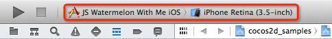
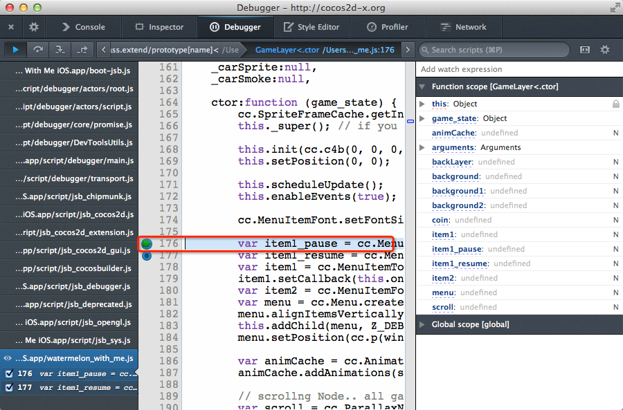

FirefoxでJavaScriptのリモートデバッグ 
======================================

Cocos2d-x JSBは2Dゲームを開発するのに適しています。C++と比べ,簡単かつ少ない時間で開発することが可能です。  
しかし,v3.0 alpha以前ではC++のプロジェクトのようにJSBのプロジェクトをデバッグすることができませんでした。 なにか問題が発生した場合,解決することが困難でした。  
それでは非効率的なので,C++のプロジェクトのようにJSBのプロジェクトをデバッグできる解決策を導入しました。

### 必要なもの

* Cocos2d-x Version 3.0 alpha
* Firefox Version 24

デバッグ環境 (このデバッグソリューションは他の環境でも適用できます)

* Mac OS X 10.9
* Xcode 5.02

### 準備

1. Firefoxを開き,アドレスバーに**about:config**と入力します。 これはいくつかのデフォルトオプションを変更する方法です。

2. 以下の3つのデフォルトオプションを変更します。

Preference Name                  | Status   | Type    | Value 
---------------------------------|----------|---------|-------
devtools.debugger.remote-enabled | user set | boolean | true
devtools.debugger.remote-host    | user set | string  | 127.0.0.1
devtools.debugger.remote-port    | user set | string  | 5086

### プロジェクトのコードを編集

JSBのプロジェクトをデバッグするには,プロジェクト内でこの機能を有効にする必要があります。  
以下のソースコードを**AppDelegate.cpp**に追加します。

```
bool AppDelegate::applicationDidFinishLaunching()
{
    ...
    
    ScriptingCore* sc = ScriptingCore::getInstance();
    sc->addRegisterCallback( register_all_cocos2dx );
    sc->addRegisterCallback( register_all_cocos2dx_extension );
    sc->addRegisterCallback( register_cocos2dx_js_extensions );
    sc->addRegisterCallback( jsb_register_chipmunk );
    sc->addRegisterCallback( register_all_cocos2dx_extension_manual );
    sc->addRegisterCallback( register_CCBuilderReader );
    sc->addRegisterCallback( jsb_register_system );
    sc->addRegisterCallback( JSB_register_opengl );
    
    sc->start();
    
    // これらのソースコードを追加する必要があります。
#if defined( COCOS2D_DEBUG ) && ( COCOS2D_DEBUG > 0 )
    sc->enableDebugger();   // デバッガを有効にします
#endif

   ...
}
```

### JSBリモートデバッガをチェックアウト

目標を達成する前に3つのステップが必要です。  
まず,このデバッグ方法はFirefoxのWeb開発者ツールに基づいているので,プロジェクトをFirefoxに接続している必要があります。

#### プロジェクトを実行します

まず最初に,Xcodeでプロジェクトを実行し,Firefoxに接続します。  
ここではJSBのプロジェクトをデバッグする例として,**WatermelonWithMe**というプロジェクトを利用します。  
プロジェクトを開いたら,スクリーンショットのように実行するプロジェクトを選択してください。  
プロジェクトのパスは**cocos2d-x-3.0alpha1/build/cocos2d_samples.xcodeproj**となっています。




#### プロジェクトをFirefoxに接続します

Xcodeでプロジェクトが実行されたら,Firefoxを開き**Tools->Web Developer->Connect...**を選択してください。


以下のスクリーンショットのような画面が表示されると思います。


**Connect**をクリックし,**Hello Cocos2d-X JSB**を選択してください。


これでJSBのプロジェクトをデバッグする為のデバッガを使用することができます。


### プロジェクトをデバッグします

JSBのプロジェクトをデバッグする方法として,「ブレークポイントを設定する」と「ステップオーバー」があります。

#### ブレークポイントを設定する

デバッグしたいjsファイルを選択し,C++のプロジェクトのようにブレークポイントを設定します。  
**F8**キーを押してデバッグを開始すると,次のスクリーンショットのように変数と引数に関するいくつかの情報が表示されます。



#### ステップオーバー

問題を見つけるためにメソッドやループ処理内にジャンプする必要があります。そんな場合に使用するのがステップオーバーです。  
幸いにもJSBリモートデバッガは,バグを簡単に見つけることができるこの機能を提供しています。


#### ステップイン

JSBリモートデバッガではステップインを実装していませんが,ループやメソッドにブレークポイントを設定することができます。