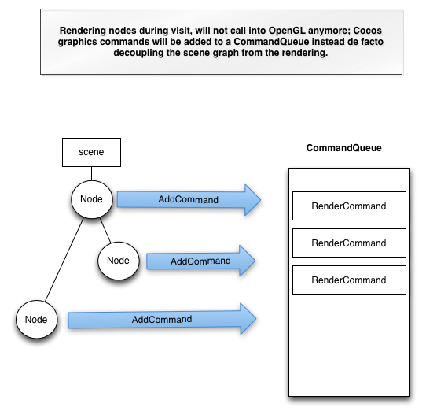

# 新しいレンダラーの紹介

## 概要
この記事は,開発者の視点から見たCocos2d-x v3.xのレンダリングパイプラインの概要となっています。  
これは,コアエンジンチームによって提供されるオリジナルの[ロードマップ](https://docs.google.com/document/d/17zjC55vbP_PYTftTZEuvqXuMb9PbYNxRFu0EGTULPK8/edit)の置換ではありません。

**※** 新しいレンダリングパイプラインの実装の詳細はカバーしきれていない状態です。貢献して頂ける場合は,ロードマップのドキュメントを参照してください。

それでは新しいレンダリングパイプラインのビジョンを見ていきましょう。

## ビジョン
Cocos2d-x v3.xのレンダリングパイプラインは,最近のモバイルデバイスに普及してきたマルチコアCPUを活用することで,レンダリングのパフォーマンスの向上を図っています。

その一方,Cocos2d-x v3.xのAPIスタイルはCocos2d-x v2.xとの互換性があり,今までCocos2d-x v2.xを使用してきたCocos2d-xユーザもすぐに馴染めるようになっています。

## ゴール
新しく実装された機能と,改善の目標点を次のようにまとめることができます。

- レンダラーとシーングラフの切り離し
- 視錐台ジオメトリカリング
- 別スレッド上でのレンダリング
- 自動バッチ処理
- (ノードベース)カスタマイズ可能なレンダリング
- 2Dの機能を最適化をしているが,3Dの機能にも適している

## ロードマップ
現在,Cocos2d-x v3.0betaではレンダラーをシーングラフから切り離しており,自動バッチ処理及び自動カリングをサポートしています。

レンダリングについての詳細を知りたい場合,このリンク先を参照してください。[ロードマップ](https://docs.google.com/document/d/17zjC55vbP_PYTftTZEuvqXuMb9PbYNxRFu0EGTULPK8/edit#heading=h.dii2kgdfqgcp)

## 新しいレンダリングアーキテクチャの概要
上記でも言及したように,実際のレンダリングは別のスレッド上で行われ,**RenderQueue**がグラフィックカードに直接OpenGLコマンドを発行しています。

次のスクリーンショットの用になっています。

シーングラフのプロセスは,様々なコマンドを生成しながらフロントエンドのスレッドで実行されます。  
各コマンドは,CommandQueueに送信され(ソートや再配置が行われる)別々のバックエンドスレッドで実行されます。

各コマンドの内部形式はこのドキュメントでの説明の範囲外になるので,ロードマップのドキュメントをご覧になってください。

Cocos2d-x v3.xを拡張する場合・・  
例えば,いくつかのスプライトを定義したい場合,描画コードをカスタマイズする必要があり,古いdraw関数は使用することはできません。
draw関数の要求に応じたコマンドを構成する必要があり,対応するコマンドを熟知する必要があります。

詳細についてはCocos2d-x v3.0betaに組み込まれている[DrawNode](https://github.com/chukong/cocos2d-x/blob/develop/cocos/2d/CCDrawNode.cpp)のページでご覧になることができます。

## 要約
Cocos2d-x v3.xのレンダリングパイプラインは制作されたばかりで,完成に近づけるためには多くの時間と試行するユーザが必要となります。  
[GitHub](https://github.com/cocos2d/cocos2d-x)のプルリクエストを使うと,あなたの意見やコメントを送信することができます。  
どのような種類のコメントでも構わないので,貢献して頂けることを願っています。