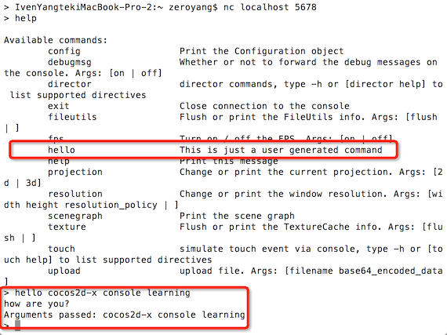

#Cocos2d-x Console模块

##简介

在Cocos2d-x 3.0 版新增了Console模块，可实现远程调试。在PC上连接5678端口，即可连接应用程序，输入对应的命令进行调试功能。目前已实现"fps on","fps off","scene graph","help","exit"等命令，开发者还可继承Console类添加自己的调试命令。

在设置主角的属性，无敌状态，制造物品，查看各种细节数据等等；这些复杂的游戏调试，使用Console，进行远程调试还是很必须。

下面我们来研究Console模块的使用


##工程建立


- 环境
	- Cocos2d-x v3.0
	- mac + xcode

- 搭建工程

	1. 下载 [Cocos2d-x 3.0](http://www.cocos2d-x.org/download)
	2. 解压cocos2d-x-3.0.zip,进入cocos2d-x-3.0，运行 `setup.py`
	3. 运行 `cocos` 脚本创建工程

Example:

```
$ cd cocos2d-x
$ ./setup.py
$ source FILE_TO_SAVE_SYSTEM_VARIABLE
$ cocos new MyGame -p com.your_company.mygame -l cpp -d NEW_PROJECTS_DIR
$ cd NEW_PROJECTS_DIR/MyGame

```
按照上面操作执行

```
IvenYangtekiMacBook-Pro-2:Documents zeroyang$ cocos new ConsoleTest -p com.your_company.ConsoleTest -l cpp 
Runing command: new
> Copy template into /Users/zeroyang/Documents/ConsoleTest
> Copying cocos2d-x files...
> Rename project name from 'HelloCpp' to 'ConsoleTest'
> Replace the project name from 'HelloCpp' to 'ConsoleTest'
> Replace the project package name from 'org.cocos2dx.hellocpp' to 'com.your_company.ConsoleTest'
IvenYangtekiMacBook-Pro-2:Documents zeroyang$ 
```

我们创建了一个基于Cocos2d-x 3.0版本的ConsoleTest空工程。


##Console类


- 类简介

 Console 是一个让开发者通过 TCP 连接控制游戏的助手(helper)类.
 Console将产生一个监听特定 TCP 端口的新线程.
 Console有一个基本的命令解析器(token parser).每一条命令都会调用`std::function<void(int)>`.
 如果`std::function<>`需要使用 Cocos2d API, 它需要调用
 
  
 ```
 scheduler->performFunctionInCocosThread( ... );
 ```
具体Console 相关API可以查看`./cocos/base/CCConsole.h`文件

- 用法

使用Console只需加入一句代码就可以了：

```
Director::getInstance()->getConsole()->listenOnTCP(5678);
```
端口号可以随意。

##如何使用

### Cocos2d-x程序 打开Console监听

在HelloWorldScene.cpp的init方法加入下面代码：

```
Director::getInstance()->getConsole()->listenOnTCP(5678);
```

### Pc端监听，启用终端控制台

编译运行ConsoleTest，打开一个Terminal，输入如下命令：

```
nc localhost 5678
```

Cocos2d-x已经定义了很多命令，具体可以看help, 输入help，回车， PC控制台输入可用的远程控制命令如下：


试一试 fps on/off

```
> fps off
```
你发现程序的 fps显示不见了

```
> fps on
```
程序的fps重新显示。


### 添加自定义Console命令
其实是使用游戏控制台最重要的是自定义的控制台命令，比如 设置主角的属性，无敌状态，制造物品，查看各种细节数据等等；这些在调试复杂游戏的时候都是必须的，首先就是要先定义自己的控制台命令。
添加新命令当然也很简单：

在HelloWorldScene.cpp的init方法加入下面代码：

```
    //自定义Console命令
    static struct Console::Command commands[] = {
        {"hello",//命令名称
            "This is just a user generated command",//说明
            /*
             回调函数的第一个参数其实就是socket的句柄，使用send向client发送数据，
             第2个参数是命令所带的参数字符串。
             */
            [](int fd, const std::string& args) {
            const char msg[] = "how are you?\nArguments passed: ";
            send(fd, msg, sizeof(msg),0);
            send(fd, args.c_str(), args.length(),0);
            send(fd, "\n",1,0);
                /*
                 如果回调函数中需要使用cocos2d的api就必须在
                 performFunctionInCocosThread函数中调用。
                 
                 ...
                 Director::getInstance()->getScheduler()->performFunctionInCocosThread([]{...});
                 ...
                 
                 */
        }},
    };
    Director::getInstance()->getConsole()->addCommand(commands[0]);

```

自定义命令 hello的使用


你会发现，命令里面多了一条hello 指令。在PC控制台输入hello指令，执行如下:

```
> hello cocos2d-x console learning
how are you?
Arguments passed: cocos2d-x console learning
```
Cocos2d-x console learning 是hello指令的传递参数。

## 总结

Console模块的使用就到此了。如果是运行ios或者android设备工程，把localhost改为相应设备的ip地址，要确保开发机和设备在同一内网。完整测试代码[在此下载](./ConsoleTest.zip).

