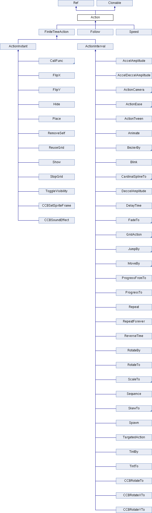

#动作

##原理介绍




动作类(Action)是所有动作的基类，它创建的一个对象代表一个动作。动作作用于Node，因此每个动作都需要由Node对象执行。动作类(Action)作为基类，实际上是一个接口，动作类的大多数实现类都派生于有限时间动作类(FiniteTimeAction)。

在实际开发中我们通常用到两类动作-即时动作和持续动作，它们均继承于有限时间动作类。
								
##即时动作

即时动作只能够立刻完成的动作，这类动作是在下一帧立刻完成的动作，如设定位置,设定缩放等。把它们包装成动作后，可以与其他动作类组合为复杂动作。

下面介绍一些常用即时动作

###Place

该动作用于将节点放置到某个指定位置，其作用与修改节点的position属性相同。例如，将节点放到屏幕坐标(10, 10)处的代码如下:

```
	auto placeAction = Place::create(Point(10, 10));
```

###FlipX和FlipY

这两个动作分别用于将精灵沿X轴和Y轴反向显示，其作用与设置精灵的FlipX和FlipY属性相同，将其包装成动作是为了便于与其他动作进行组合。

下面代码将一个精灵移动到一端后反向显示再进行移回原点的动作：


```
	auto flipxAction = FlipX::create(true);
    auto moveTo = MoveTo::create(0.4f, Point(0, 0));
    auto action = Sequence::create(moveTo, flipxAction, moveTo->reverse(), NULL);
```

其中Sequence是动作序列，后面将详细介绍，reverse的作用是获得原动作的逆动作。

###Show和Hide

这两个动作分别用于显示和隐藏节点，其作用与设置节点的visible属性作用一样。例如，为了使精灵完成移动后隐藏起来，可以用如下代码：

```
	auto hideAction = Hide::create();
    auto moveTo = MoveTo::create(0.4f, Point(0, 0));
    auto action = Sequence::create(moveTo, hideAction, NULL);
```

###CallFunc

CallFunc系列动作包括CallFunc,CallFuncN两个动作，用来在动作中进行方法调用。在游戏中为了节约内存资源，我们可以在动作完成后调用相应函数清理内存，如下代码：

```
	auto actionMoveDone = CallFuncN::create([&](Ref* sender){
        log("Clear memory");
    });
	auto moveTo = MoveTo::create(0.4f, Point(0, 0));
    auto action = Sequence::create(moveTo, actionMoveDone, NULL);
```

##持续动作

###属性变化动作

属性变化动作通过属性值的逐渐变化来实现动画效果。需要注意的是XXTo和XXBy的区别在于XXTo是表示最终值，而XXBy则表示向量-改变值。

**MoveTo和MoveBy**

用于使节点做直线运动，设置了动作时间和终点位置，在规定时间内会移动到终点，它们的初始化方法如下：

```
	MoveTo::create(float duration, const Point& position);
	MoveBy::create(float duration, const Point& position);
```

MoveTo的position值表示最后位置，而MoveBy的position则表示移动的位置。

**JumpTo和JumpBy**

使节点以一定的轨迹跳跃到指定位置，它们的初始化方法如下：

```
	JumpTo::create(float duration, const Point& position, float height, int jumps);
	JumpBy::create(float duration, const Point& position, float height, int jumps);
```

**BezierTo和BezierBy**

使节点进行曲线运动，运动的轨迹由贝塞尔曲线描述。

每条贝塞尔曲线都包含一个起点和一个终点。在一条曲线中，起点和终点各自包含一个控制点，而控制点到端点的连线称作控制线。控制点决定了曲线的形状，包含角度和长度两个参数。如下图：


使用时，我们要先创建ccBezierConfig结构体，设置好终点endPosition以及两个控制点controlPoint_1和controlPoint_2后，再把结构体传入BezierTo或BezierBy的初始化方法中：

```
	ccBezierConfig bezier;
    bezier.controlPoint_1 = Point(0, 0);
    bezier.controlPoint_2 = Point(100, 100);
    bezier.endPosition = Point(50, 100);
    auto bezierAction = BezierTo::create(0.5f, bezier);
```

**ScaleTo和ScaleBy**

产生缩放效果，使节点的缩放系数随时间线性变化，对应初始化方法为：

```
	ScaleTo::create(float duration, float s);
	ScaleBy::create(float duration, float s);
```

**RotateTo和RotateBy**

产生旋转效果，对应初始化方法为：

```
	RotateTo::create(float duration, float deltaAngle);
	RotateBy::create(float duration, float deltaAngle);
```

###视觉特效动作

该类用来实现特殊视觉效果

**FadeIn, FadeOut和FateTo**

产生淡入淡出效果，和透明变化效果，对应的初始化方法为：

```
	FadeIn::create(float d);	淡入
	FadeOut::create(float d);	淡出 
	FadeTo::create(float duration, GLubyte opacity); 一定时间内透明度变化
```

**TintTo和TintBy**

设置色调变化，这个动作较少使用，初始化方法为：

```
	TintTo::create(float duration, GLubyte red, GLubyte green, GLubyte blue);
	TintBy::create(float duration, GLubyte red, GLubyte green, GLubyte blue);
```

red, green, blue的取值范围为0~255

**Blink**

使节点闪烁，其初始化方法为：

```
	Blink::create(float duration, int blinks);
```

其中blinks为闪烁次数

**Animation**

以帧动画形式实现动画效果，以下代码用两种方法实现精灵帧动画效果：

```
	//手动创建动画
	auto animation = Animation::create();
    for( int i=1;i<15;i++)
    {
        char szName[100] = {0};
        sprintf(szName, "sprite_%02d.png", i);
        animation->addSpriteFrameWithFile(szName);
    }
    
    animation->setDelayPerUnit(2.8f / 14.0f);
    animation->setRestoreOriginalFrame(true);

    auto action = Animate::create(animation);
    sprite->runAction(Sequence::create(action, action->reverse(), NULL));
    
    
    //文件创建动画
    auto cache = AnimationCache::getInstance();
    cache->addAnimationsWithFile("animation.plist");
    auto animation2 = cache->getAnimation("dance_1");

    auto action2 = Animate::create(animation2);
    sprite->runAction(Sequence::create(action2, action2->reverse(), NULL));
```

动画创建后需要一个动画播放器来播放这些动画，这个播放器就是Animate。


###复合动作

通常在开发中我们需要将各种动作组合起来再让节点执行，复合动作的作用就是将各种动作组合在一起。而且，复合动作本身也是动作。因此可以作为一个普通动作嵌入到其他动作中。

> 注意：Sequence动作不能嵌入其他复合动作内使用，DelayTime不属于复合动作，但是只能在复合动作内使用。

**DelayTime**

延时动作其实什么都不做，提供一段空白期，它只有一个初始化方法：

```
	DelayTime::create(float d);
```

d表示需要延时的时间。

**Repeat/RepeatForever**

反复执行某个动作，通常我们用Repeat和RepeatForever这两个方法执行：

```
	Repeat::create(FiniteTimeAction *action, unsigned int times);
	RepeatForever::create(ActionInterval *action);
```
					
**Spawn**

使一批动作同时执行，他的两个初始化方法：

```
	Spawn::create(FiniteTimeAction *action1, ...);
	Spawn::create(const Vector<FiniteTimeAction*>& arrayOfActions);
```
 								
**Sequence**

让各种动作有序执行，以下为它的两个初始化方法：

```
	Sequence::create(FiniteTimeAction *action1, ...);
	Sequence::create(const Vector<FiniteTimeAction*>& arrayOfActions);
```

###变速动作

变速动作和符合动作类似，也是一种特殊的动作，它可以把任何动作按照改变后的速度执行。

**Speed**

用于线性的改变某个动作的速度，为了改变一个动作的速度，首先需要将目标动作包装到Speed动作中：

```
	auto repeat = RepeatForever::create(animation);
	auto speed = Speed::create(repeat, 0.5f);
	sprite->runAction(speed);
```

第二个参数为变速比例，设置为0.5f则速度为原来一半。

**ActionEase**

Speed虽然能改变动作的速度，但是只能按比例改变速度，ActionEase可以实现动作的速度又快到慢,速度随时间改变的匀速运动。该类包含5类运动，指数缓冲,Sine缓冲,弹性缓冲,跳跃缓冲和回震缓冲。每类运动都包含3个不同时期的变换：In,Out和InOut。

以下以InSine为例：

```
	auto sineIn = EaseSineIn::create(action);
	sprite->runAction(sineIn);
```

Test Commit		
