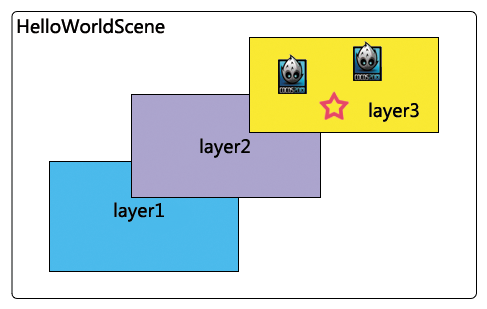

# 基础概念介绍——导演,场景,层,精灵

在Cocos2d-x-3.x引擎中，采用节点树形结构来管理游戏对象，一个游戏可以划分为不同的场景，一个场景又可以分为不同的层，一个层又可以拥有任意个可见的游戏节点（即对象，游戏中基本上所有的类都派生于节点类Node）。可以执行Action来修改游戏节点的属性，使其移动,旋转,放大,缩小等等。

每一个时刻都有一个场景在独立运行，通过切换不同的场景来完成一个游戏流程，游戏流程的管理由Director来执行，其基本框架类图如下: 


## 导演（Director）
一款游戏好比一部电影，只是游戏具有更强的交互性，不过它们的基本原理是一致的。所以在Cocos2dx中把统筹游戏大局的类抽象为导演（Director），Director是整个cocos2dx引擎的核心，是整个游戏的导航仪，游戏中的一些常用操作就是由Director来控制的，比如OpenGL ES的初始化，场景的转换，游戏暂停继续的控制，世界坐标和GL坐标之间的切换，对节点（游戏元素）的控制等，还有一些游戏数据的保存调用，屏幕尺寸的获取等都要由Director类来管理控制的。

因为Director是游戏项目的总导演，会经常调用进行一些控制，所以该Director利用了单件设计模式，也就是项目里取到的director都是同一个。用getInstance() 方法取得Director的实例，具体的API可以参考相关文档，就不做赘述了。


## 场景（Scene）
Scene场景也是cocos2dx中必不可少的元素，游戏中通常我们需要构建不同的场景（至少一个），游戏里关卡,版块的切换也就是一个一个场景的切换，就像在电影中变换舞台和场地一样。场景的一个重要的作用就是流程控制的作用，我们可以通过Director的一系列方法控制游戏中不同的场景的自由切换。

下面是Director控制场景的常用方法：

- runWithScene( Scene *scene )       启动游戏，并运行scene场景。本方法在主程序第一次启动主场景的时候调用。如果已有正在运行的场景则不能调用该方法；会调用pushScene-->startAnimation。
- pushScene( Scene *scene )          将当前运行中的场景暂停并压入到代码执行场景栈中，再将传入的scene设置为当前运行场景，只有存在正在运行的场景时才调用该方法；
- replaceScene( Scene *scene )       直接使用传入的scene替换当前场景来切换画面，当前场景被释放。这是切换场景时最常用的方法。
- popScene()                         释放当前场景，再从代码执行场景中弹出栈顶的场景，并将其设置为当前运行场景。如果栈为空，直接结束应用。和PushScene结对使用
- end()                              释放和终止执行场景，同时退出应用
- pause()                            暂停当前运行场景中的所有计时器和动作，场景仍然会显示在屏幕上
- resume ()                          恢复当前运行场景的所有计时器和动作，场景仍然会显示在屏幕上


同时场景是层的容器，包含了所有需要显示的游戏元素。通常，当我们需要完成一个场景时候，会创建一个Scene的子类，并在子类中实现我们需要的功能。比如，我们可以在子类的初始化中载入游戏资源，为场景添加层，启动音乐播放等等。


## 层（Layer）
Layer是处理玩家事件响应的Node子类。与场景不同，层通常包含的是直接在屏幕上呈现的内容，并且可以接受用户的输入事件，包括触摸，加速度计和键盘输入等。我们需要在层中加入精灵，文本标签或者其他游戏元素，并设置游戏元素的属性，比如位置，方向和大小；设置游戏元素的动作等。通常，层中的对象功能类似，耦合较紧，与层中游戏内容相关的逻辑代码也编写在层中，在组织好层后，只需要把层按照顺序添加到场景中就可以显示出来了。要向场景添加层，我们可以使用addChild方法。

addChild( Node * child )
addChild( Node *child, int zOrder )
addChild( Node *child, int zOrder, int tag )

其中，Child参数就是节点。对于场景而言，通常我们添加的节点就是层。先添加的层会被置于后添加的层之下。如果需要为它们指定先后次序，可以使用不同的zOrder值。tag是元素的标识号码，如果为子节点设置了tag值，就可以在它的父节点中利用tag值就可以找到它了。层可以包含任何Node作为子节点，包括Sprites(精灵), Labels(标签)，甚至其他的Layer对象。

 
上图所示的图片中，叫做HelloWorldScene的场景中有三个不同层，在layer3层上又有上个不同的精灵。

下面是一个创建三个不同层的例子：

	auto layer = LayerColor::create(Color4B(0, 128, 128, 255));
	layer->setContentSize(CCSizeMake(120, 80));
	layer->setPosition(Point(50, 50));
	addChild(layer, 10);
	auto layer1 = LayerColor::create(Color4B(128, 0, 128, 255));
	layer1->setContentSize(CCSizeMake(120, 80));
	layer1->setPosition(Point(100, 80));
	addChild(layer1, 20);
	auto layer2 = LayerColor::create(Color4B(128, 128, 0, 255));
	layer2->setContentSize(CCSizeMake(120, 80));
	layer2->setPosition(Point(150, 110));
	addChild(layer2, 30);

    

## 精灵

Cocos2d中的精灵和其他游戏引擎中的精灵相似，它可以移动，旋转，缩放，执行动画，并接受其他转换。Cocos2dx的Sprite由Texure，frame和animation组成，由openes负责渲染。主要的类关系如下:

简单过程可描述为：使用Texture2D加载图片，可以用Texture2D生成对应的SpriteFrame（精灵帧），将SpriteFrame添加到Animation生成动画数据，用Animation生成Animate（就是最终的动画动作），最后用Sprite执行这个动作。


创建精灵的几种方式：

- 直接创建:

```    
	auto sprite = Sprite::create("HelloWorld.png");      
	this->addChild(sprite,0);
```	
- 使用纹理来创建精灵     
 
```
	auto sprite1 = Sprite::createWithTexture(TextureCache::getInstance()->addImage("HelloWorld.png"));
	this->addChild(sprite1, 0);
```	

- 使用精灵帧来创建精灵      

```
	auto sprite2=Sprite::createWithSpriteFrameName("HelloWorld.png");　　
	this->addChild(sprite2, 0);
```

在Cocos2dx中实现精灵显示的基本过程如下：

	//创建Scene
	auto scene = Scene::create();
	//创建层
	auto layer = HelloWorld::create();
	//把层加入场景中
	scene->addChild(layer);
	//创建一个精灵
	auto sprite = Sprite::create("HelloWorld.png");
	//把精灵加到层里
	layer->addChild(sprite, 0);
