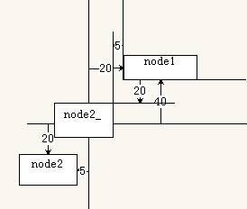
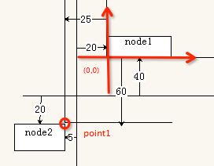

#Cocos2d-x 3.0坐标系详解

Cocos2d-x坐标系和OpenGL坐标系相同，都是起源于笛卡尔坐标系。

##笛卡尔坐标系

笛卡尔坐标系中定义右手系原点在左下角，x向右，y向上，z向外，OpenGL坐标系为笛卡尔右手系。


###屏幕坐标系和Cocos2d坐标系

标准屏幕坐标系使用和OpenGL不同的坐标系，而Cocos2d则使用和OpenGL相同的坐标系。

iOS, Android, Windows Phone等在开发应用时使用的是标准屏幕坐标系，原点为屏幕左上角，x向右，y向下。

Cocos2d坐标系和OpenGL坐标系一样，原点为屏幕左下角，x向右，y向上。


在开发中，我们经常会提到两个比较抽象的概念-世界坐标系和本地坐标系。这两个概念可以帮助我们更好的理解节点在Cocos2d坐标系中的位置以及对应关系。

###世界坐标系(World Coordinate) VS 本地坐标系（Node Local）

世界坐标系也叫做绝对坐标系，是游戏开发中建立的概念。因此，“世界”指游戏世界。cocos2d中的元素是有父子关系的层级结构，我们通过Node的setPosition设定元素的位置使用的是相对与其父节点的本地坐标系而非世界坐标系。最后在绘制屏幕的时候cocos2d会把这些元素的本地坐标映射成世界坐标系坐标。

本地坐标系也叫相对坐标系，是和节点相关联的坐标系。每个节点都有独立的坐标系，当节点移动或改变方向时，和该节点关联的坐标系将随之移动或改变方向。

##锚点（Anchor Point）

将一个节点添加到父节点里面时，需要设置其在父节点上的位置，本质上是设置节点的锚点在父节点坐标系上的位置。

- Anchor Point的两个参数都在0~1之间。它们表示的并不是像素点，而是乘数因子。(0.5, 0.5)表示Anchor Point位于节点长度乘0.5和宽度乘0.5的地方，即节点的中心

- 在Cocos2d-x中Layer的Anchor Point为默认值(0, 0)，其他Node的默认值为(0.5, 0.5)。

我们用以下代码为例，使用默认Anchor Point值，将红色层放在屏幕左下角，绿色层添加到红色层上：

```
auto red = LayerColor::create(Color4B(255, 100, 100, 128), visibleSize.width/2, visibleSize.height/2);

auto green = LayerColor::create(Color4B(100, 255, 100, 128), visibleSize.width/4, visibleSize.height/4);

red->addChild(green);

this->addChild(red, 0);
```


我们用以下代码为例，将红色层的Anchor Point设为中点放在屏幕中央，绿色层添加到红色层上，绿色层锚点为右上角：

`注：`因为Layer比较特殊，它默认忽略锚点，所以要调用`ignoreAnchorPointForPosition()`接口来改变锚点，关于`ignoreAnchorPointForPosition()`接口的使用说明，我们将在后面详细讲解。

```
auto red = LayerColor::create(Color4B(255, 100, 100, 128), visibleSize.width/2, visibleSize.height/2);
red->ignoreAnchorPointForPosition(false);
red->setAnchorPoint(Point(0.5, 0.5));
red->setPosition(Point(visibleSize.width/2 + origin.x, visibleSize.height/2 + origin.y));

auto green = LayerColor::create(Color4B(100, 255, 100, 128), visibleSize.width/4, visibleSize.height/4);
green->ignoreAnchorPointForPosition(false);
green->setAnchorPoint(Point(1, 1));
red->addChild(green);

this->addChild(red, 0);
```


##忽略锚点(Ignore Anchor Point)

Ignore Anchor Point全称是ignoreAnchorPointForPosition，作用是将锚点固定在一个地方。

如果设置其值为true，则图片资源的Anchor Pont固定为左下角，否则即为所设置的位置。

我们用以下代码为例，将两个层的ignoreAnchorPointForPosition设为true，并将绿色的层添加到红色的层上：

```
auto red = LayerColor::create(Color4B(255, 100, 100, 128), visibleSize.width/2, visibleSize.height/2);
red->ignoreAnchorPointForPosition(true);
red->setPosition(Point(visibleSize.width/2 + origin.x, visibleSize.height/2 + origin.y));

auto green = LayerColor::create(Color4B(100, 255, 100, 128), visibleSize.width/4, visibleSize.height/4);
green->ignoreAnchorPointForPosition(true);

red->addChild(green);

this->addChild(red, 0);
```


##VertexZ，PositionZ和zOrder

- VerextZ是OpenGL坐标系中的Z值
- PositionZ是Cocos2d-x坐标系中Z值
- zOrder是Cocos2d-x本地坐标系中Z值

在实际开发中我们只需关注zOrder。

可以通过`setPositionZ`接口来设置PositionZ。


以下是`setPositionZ`接口的说明：

```
Sets the 'z' coordinate in the position. It is the OpenGL Z vertex value.
```

即PositionZ的值即为opengl的z值VertexZ。同样节点的PositionZ也是决定了该节点的渲染顺序，值越大，但是与zOrder不同的区别在于，PositionZ是全局渲染顺序即在根节点上的渲染顺序，而zOrder则是局部渲染顺序，即该节点在其父节点上的渲染顺序，与Node的层级有关。用以下事例来说明:

```
	auto red = LayerColor::create(Color4B(255, 100, 100, 255), visibleSize.width/2, visibleSize.height/2);
    red->ignoreAnchorPointForPosition(false);
    red->setPosition(Point(visibleSize.width / 2, visibleSize.height / 2));
    
    auto green = LayerColor::create(Color4B(100, 255, 100, 255), visibleSize.width/4, visibleSize.height/4);
    green->ignoreAnchorPointForPosition(false);
    green->setPosition(Point(visibleSize.width / 2, visibleSize.height / 2 - 100));
    red->setPositionZ(1);
    green->setPositionZ(0);
    this->addChild(red, 0);
    this->addChild(green, 1);
```


虽然green的zOrder大于red的zOder，但是因为red的PositionZ较大，所以red还是在green上面显示。

##触摸点（Touch position)

所以在处理触摸事件时需要用重写以下四个函数：

```
	virtual bool onTouchBegan(Touch *touch, Event * event);
    virtual void onTouchEnded(Touch *touch, Event * event);
    virtual void onTouchCancelled(Touch *touch, Event * event);
    virtual void onTouchMoved(Touch *touch, Event * event);

```

在函数中获取到touch，我们在设计游戏逻辑时需要用到触摸点在Cocos2d坐标系中的位置，就需要将touch的坐标转换成OpenGL坐标系中的点坐标。

Touch position是屏幕坐标系中的点，OpenGL position是Cocos2d-x用到的OpenGL坐标系上的点坐标。通常我们在开发中会使用两个接口`getLocation()`和`getLocationInView()`来进行相应坐标转换工作。

在开发中一般使用`getLocation()`获取触摸点的GL坐标，而`getLocation()`内部实现是通过调用`Director::getInstance()->convertToGL(_point);`返回GL坐标。

此外，关于世界坐标系和本地坐标系的相互转换，在Node中定义了以下四个常用的坐标变换的相关方法。

```
	// 把世界坐标转换到当前节点的本地坐标系中
	Point convertToNodeSpace(const Point& worldPoint) const;
    
    // 把基于当前节点的本地坐标系下的坐标转换到世界坐标系中
    Point convertToWorldSpace(const Point& nodePoint) const;
    
    // 基于Anchor Point把基于当前节点的本地坐标系下的坐标转换到世界坐标系中
    Point convertToNodeSpaceAR(const Point& worldPoint) const;
    
    // 基于Anchor Point把世界坐标转换到当前节点的本地坐标系中
    Point convertToWorldSpaceAR(const Point& nodePoint) const;
```

下面通过一个例子来说明这四个方法的理解和作用:

```
	auto *sprite1 = Sprite::create("HelloWorld.png");
    sprite1->setPosition(ccp(20,40));
    sprite1->setAnchorPoint(ccp(0,0));
    this->addChild(sprite1);  //此时添加到的是世界坐标系，也就是OpenGL坐标系
    
    auto *sprite2 = Sprite::create("HelloWorld.png");
    sprite2->setPosition(ccp(-5,-20));
    sprite2->setAnchorPoint(ccp(1,1));
    this->addChild(sprite2); //此时添加到的是世界坐标系，也就是OpenGL坐标系
    
    //将 sprite2 这个节点的坐标ccp(-5,-20) 转换为 sprite1节点 下的本地(节点)坐标系统的 位置坐标
    Point point1 = sprite1->convertToNodeSpace(sprite2->getPosition());
    
    //将 sprite2 这个节点的坐标ccp(-5,-20) 转换为 sprite1节点 下的世界坐标系统的 位置坐标
    Point point2 = sprite1->convertToWorldSpace(sprite2->getPosition());
    
    log("position = (%f,%f)",point1.x,point1.y);
    log("position = (%f,%f)",point2.x,point2.y);
```

```
运行结果：

Cocos2d: position = (-25.000000,-60.000000)
Cocos2d: position = (15.000000,20.000000)
```




其中:`Point point1 = sprite1->convertToNodeSpace(sprite2->getPosition());` 

相当于`sprite2`这个节点添加到（实际没有添加，只是这样理解）`sprite1`这个节点上，那么就需要使用`sprite1`这个节点的节点坐标系统，这个节点的节点坐标系统的原点在（20，40），而`sprite1`的坐标是（-5，-20），那么经过变换之后，`sprite1`的坐标就是（-25，-60）。

其中:`Point point2 = sprite1->convertToWorldSpace(sprite2->getPosition());`

此时的变换是将`sprite2`的坐标转换到`sprite1`的世界坐标系下，而其中世界坐标系是没有变化的，始终都是和OpenGL等同，只不过`sprite2`在变换的时候将`sprite1`作为了”参照“而已。所以变换之后`sprite2`的坐标为:（15，20）。

