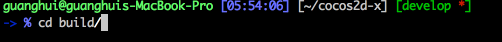
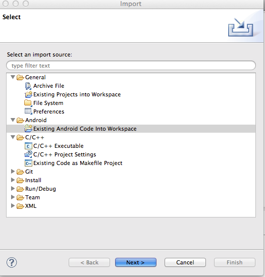
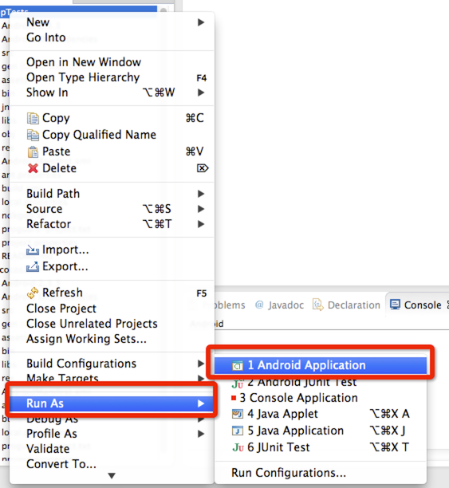

# How to Build an Android Project with Eclipse

In this document, I will show you how to build Cocos2d-x and android project with Eclipse. Since Eclipse is a multi-platform software, here I just use MacOS as an example.
The processes in other platforms should be more or less the same.

## Prerequisite

- Download Eclipse with ADT bundle

If you had downloaded [Android SDK](https://developer.android.com/sdk/index.html?hl=sk) before,  there maybe an Eclipse folder under the Android SDK folder.
You can just double click the Eclipse icon to launch the program.

- Install JDK, Android NDK, python and configure them.

I highly recommend you to refer to [this documentation](https://github.com/cocos2d/cocos-docs/blob/master/manual/framework/native/getting-started/v3.0/how-to-run-cpp-tests-on-android/en.md) to configure a command line development environment for Android.

At least, you should have configured all the JDK, Android NDK and python stuff.

If you can run the python command to build the android project successfully, it would be much easier to start with Eclipse.

## The Workflow

When we deal with building Android project with Eclipse, the suggested the workflow would be as follows:

- Go to proj.android directory and run `python build_native.py`. (Note: If you are trying to build the Cpp-Tests, you should go to `build` directory and run `python android-build.py -p 10 cpp-tests`
command.) If you don't know how to do this, please refer to [this link](https://github.com/cocos2d/cocos-docs/blob/master/manual/framework/native/getting-started/v3.0/how-to-run-cpp-tests-on-android/en.md) for more information.

- Open the existing Android project with Eclipse.

- Import the libcocos2dx project.(Caution: Don't import the libcocos2dx project under Cocos2d-x directory unless you are building cpp-tests project. If you create a project with `cocos` command, make sure you are importing the libcocos2dx under your own project directory.)

- Build and Run the Android project.

I will use the next two examples to show you how to perform this workflow.

## Build the Cpp-Tests

### Build Cpp-Tests by using the python scripts.

At first, you should download [Cocos2d-x](http://www.cocos2d-x.org/download) and unzip it under a location. We unzip it under my home directory.

Then open Terminal, and cd to the `build` directory of the Cocos2d-x folder. Here is the screenshot:

And run `python android-build.py -p 10 cpp-tests` command to build the cpp-tests android project. 

If you get a build success message from the Terminal then you should check whether there is a libcocos2dcpp.so file located
in `[Cocos2d-x root]tests/cpp-tests/proj.android/libs/armeabi/libcpp_tests.so `.

### Open the proj.android project with Eclipse.

Here is the process:

- Launch Eclipse

- Right click your mouse at the empty area of the `Package Explorer` and choose `Import...`. 

- Choose `Existing Android Code Into Workspace` from the pop up dialog and Click `Next`.

- Click the `Browse...` button to choose the directory of Cpp-Tests' `proj.android`. and Click Ok.

Before choosing the `proj.android` directory:

After choosing the `proj.android` directory:

- Click Finish.

If all the above processes are correct, the `Finish` button will be enabled and you should click it.

### Import Libcocos2dx Project
This is more or less the same process as we do in the previous section except for the path of the `proj.android` is different.

The path of the libcocos2dx project is `[your Cocos2d-x root]cocos/2d/platform/android/java`. 

### Build and Run the Android Project
Now you could build and run you Android project. But it still need some effects to get it done.

At first, you should connect your Android phone with `USB remote debugging` option enabled.

Then, you should make sure your computer can recognize your phone which means you might need to install some drivers for your phone.

At last, Just Right Click The `CppTests` project and choose `Run as...` -> `Android Application`.

Here is the screenshot:

## Build an Empty Project Created with the `cocos` command
The process to build an empty project created with the [cocos](https://github.com/cocos2d/cocos-docs/blob/master/manual/framework/native/getting-started/v3.0/how-to-start-a-new-game/en.md) command it more or less the same as building the Cpp-Tests project.

So let's do it quickly.

###Build it with the cocos command 
(Note this might not be the same as the previous section, but you can do it by navigating to the proj.android directory and run the build_native.py scripts.)

We could use `cocos run -s ~/MyCompany/MyGame -p android` command instead of the python scripts.  You could refer to [this document](https://github.com/cocos2d/cocos-docs/blob/master/manual/framework/native/getting-started/v3.0/how-to-start-a-new-game/en.md) for more information.

###Open the proj.android project with Eclipse
It's exactly as the process we do in the previous section.
###Import the Libcocos2dx Project
The same.. Again, to be verbose, don't forget to import the libcocos2dx project under `MyGame` folder, not the engine root.)
###Build and Run the Android Project
Tedious, it's still the same. 

## TroubleShootings
- If you get errors in the Eclipse when you imported the Android project. Don't worry, just import the libcocos2dx project will get ride of it.

- If you imported all the projects and the errors remains, you might need to build the libcocos2dx project manually and to see whether there is a libcocos2dx.jar file under the `bin` directory.

- If you installed the project in your Android phone but it crashed when launching. You should make sure there is a `libxxx.so` file under the `libs/armeabi` directory.

## In Summary
Build and run Android project with Eclipse is not very hard if you follow these processes. 

If you are getting sucked, try to clean you workspace and redo these process again.

Sometimes you might need to relaunch the Eclipse software for solving your problems.

If you still can't figure it out after struggling two more hours, please open ticket in the [forum](http://www.cocos2d-x.org/forums/6).
