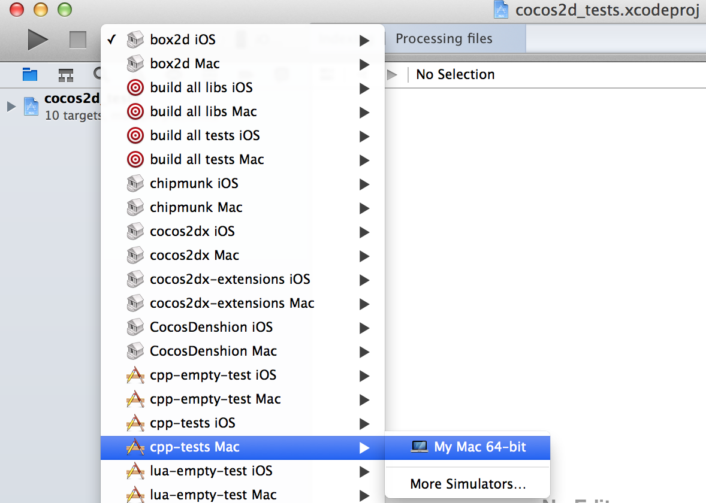
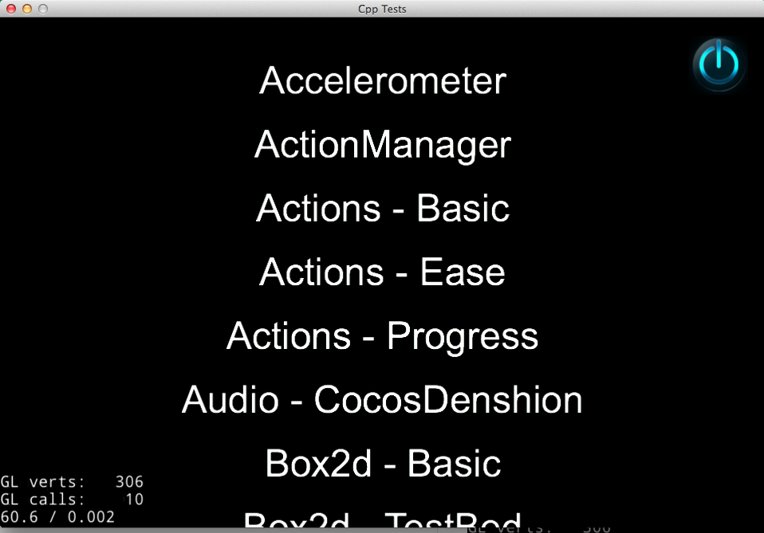

# MacOSでの動作の手引き
   
## 環境条件

* Mac OS X 10.8　もしくは　Mac OS X 10.8以上(ここでは10.9のバージョンを使っています。)
* Xcode 4.6.2 もしくは Mac OS X 10.8以上(ここでは5.0.1.のバージョンを使っています。こちらのサイトでXcodeの別バージョンをダウンロードできます<https://developer.apple.com/downloads/index.action>)

## 動作方法

* `cocos2d-x/build`のファイルの中に入り`cocos2d_tests.xcodeproj`を開いてください。
* タブから`cpp-tests Mac`を選んでください。
  
  
* `run`をクリックして,コンパイルしそして `Test cpp` のサンプルを動作させます。

  
  
* 動作中:

  
  
* `stop` を押すとサンプルを停止させることができます。

  

