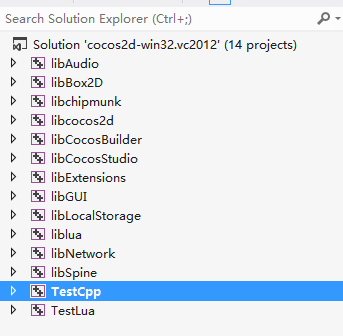
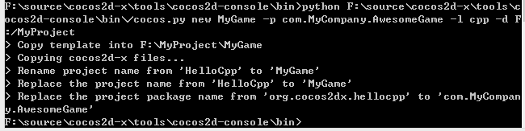
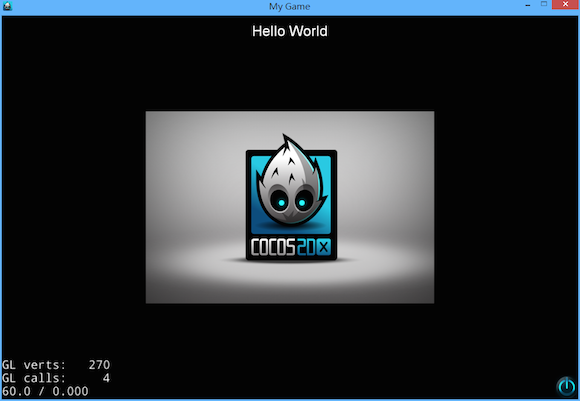

# How to Run cpp-tests on win32

In this article, I will show you how to run cpp-tests on your windows PC.

## Environmental Requirements

- Cocos2D-X version: Cocos2d-x v3.0 ([https://github.com/cocos2d/cocos2d-x/](https://github.com/cocos2d/cocos2d-x/ "cocos2d-x"))

- IDE: Visual Studio 2012

- Dependencies: python 2.7

## Compile and Run the TestCpp Project

- Download Cocos2d-x from our [download page](http://cocos2d-x.org/download) and unzip it on your working directory. The structure of the directory should look like as following:

- Open file "cocos2d-win32.vc2012.sln" in "build" folder as fllowing:

- Right click the "TestCpp" project, and select "Set as StartUp Project", then you can compile and run the TestCpp project, here is the screenshot:

## How to Create an Empty Project

### Prerequisite

At first, you need to download and install python 2.7  to finish the following steps.

Then, you should add the path "[Cocos2d-x root]\tools\cocos2d-console\bin\" into your system environment path, don't forget to add a ';' as delimiter. For example, my bin path is "F:\source\cocos2d-x\tools\cocos2d-console\bin", and I will add it to the end of PATH as following:

(Note: The [Cocos2d-x root] is the path where you unzip your downloaded Cocos2d-x package)

 
Open *cmd* and change current path to the bin path, and input the cmd "cocos -h", if it outputs the help message, congratulations, you have added the right path in the environment variables. We can create a project by using *cocos2d-console* commands now. 

Type "cocos new -h", and you will get the following result :

Now it's time to use the command to create a new empty project.

For example, I want to create a cpp project, then I can type "cocos new MyGame -p com.MyCompany.AwesomeGame -l cpp -d F:/MyProject". This command will create a cpp project under F:/MyProject directory. Here is the screenshot:

### How to Compile and Run the Empty Project

Open MyGames.sln in the proj.win32 folder, press "Ctrl-F5" to compiling and running the project. If you compiles and run without any errors, you will get the following results:

