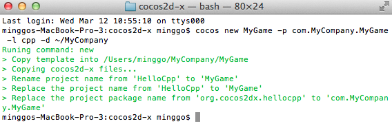

# 	新しくプロジェクトを始める方法

このドキュメンテーションは [cocos console](https://github.com/cocos2d/cocos2d-console) を使用した　新しいプロジェクトの作成及び実行方法をあなたに紹介します。 

## 環境要件

* Android 2.3 or newer
* iOS 5.0 or newer
* OS X 10.7 or newer
* Windows 7 or newer
* Linux Ubuntu 12.04 (or newer)
* Cocos2d-x v3.0rc(or newer)

## ソフトウェア要件

* Xcode 4.6 (for iOS or Mac)
* gcc 4.7 for Linux or Android. For Android ndk-r9 or newer is required.
* Visual Studio 2012 (for Windows)
* Python 2.7.5

## 新しいプロジェクトを作成します

    $ cd cocos2d-x
    $ ./setup.py
    $ source ~/.bash_profile # may be ~/.bash_login or ~/.profile, depends on your environemnt
    $ cocos new MyGame -p com.MyCompany.MyGame -l cpp -d ~/MyCompany

* `MyGame`: 作成したいプロジェクトの名前
* `-p com.MyCompany.MyGame`: 作成したいアンドロイドのパッケージ名
* `-l cpp`: プロジェクトに使用するプログラミング言語　使用するのはC++とluaです
* `-d ~/MyCompany`: あなたのプロジェクトの保存するディレクトリー

作成されたプロジェクトのフォルダー構造は以下のとおりです

（注意：プロジェクトのタイプがluaである場合,ディレクトリーが異なる可能性があります。）

## 新しいプロジェクトをビルド及び実行

    $ cocos run -s ~/MyCompany/MyGame -p ios
    
* `-s`: 新しいプロジェクトのディレクトリー。　これは絶対パスもしくは相対パスになると思われます。
* `-p`: どのプラットフォームで実行するか。　選択できるものは　ios, android, win32, mac, linux　です 

(注意：あなたはtmuxをユーザーですか？もしそうなら,reattach-to-user-namespaceのコマンド前にcoocsを追加する必要があります。
詳細については,このリンクを [this link](https://github.com/phonegap/ios-sim) ご参照ください。)

より詳細な情報については `cocos run --help` を実行することをお勧めします。

### For Win32 Users

