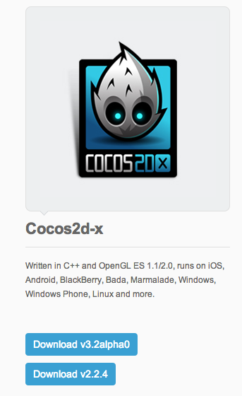
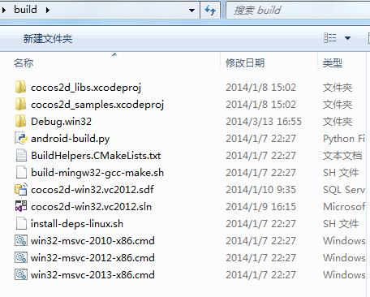
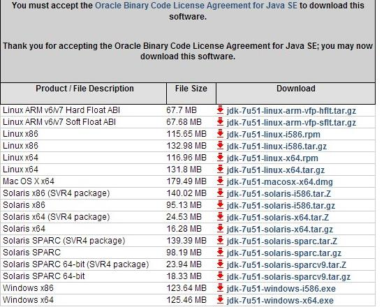
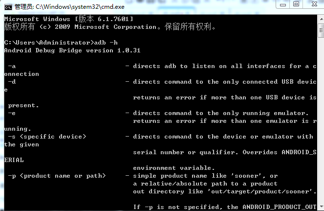
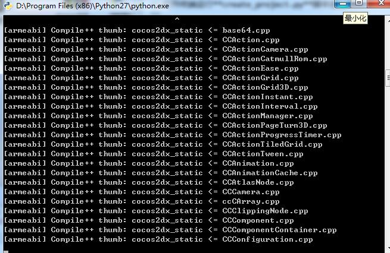

# 如何在Windows 7平台搭建Android Cocos2d-x3.2alpha0开发环境


**建议：**为避免安全相关问题，所有操作请在管理员身份下进行，在运行命令时，请确保以管理员身份打开控制台（console）。      
本指南将介绍如何在Windows 7平台搭建Cocos2d-x Android开发环境。本指南操作要求一台搭载Windows 7平台及安装Visual Studio 2012/2013的电脑。最好拥有快速稳定的网络，因为在指南操作中需要下载许多软件包。


搭建开发环境需要安装工具包括

- Visual Studio 2012/2013 ——— 因为Cocos2d-x-v3.x引擎不能用老版本的VS编译，所以我们需要下载安装Visual Studio 2012或2013。VS的安装简单，本教程不做讲解。
- Cocos2d-x ———本教程以Cocos2d-x 3.2alpha0版本为例，下载地址：[http://cocos2d-x.org/download](http://cocos2d-x.org/download)
- JAVA JDK
- Android SDK
- NDK


## 下载Cocos2d-x 3.2alpha0引擎
     
用户可以登陆[Cocos2d-x](http://www.cocos2d-x.org/) 官方网站下载最新版的Cocos2d-x。点击导航栏的“Download”（下载）后你会看到如下下载页面：



在本指南中，将会以目前最新版本的Cocos2d-x 3.2alpha0引擎为例。
（注意：如果你想要下载旧版的Cocos2d-x，可点击“looking for an old versoin?”链接。但本人强烈推荐使用最新版本的Cocos2d-x，新版引擎有很多新功能，修复了旧版的很多问题。）

右键单击“Download”链接选择“save link as…”（将链接保存为…），然后将压缩文件保存至适当的位置。本机保存位置为 D:\Cocos2d-x\Cocos2d-x 3.2alpha0。    
  
（注意：请不要将Cocos2d-x文件夹放置c:\下，因为会导致很多优先级别（privilege）相关的问题。可尝试将该文件夹放到其他盘如D:\及E:\等等。）

打开 “D:\Cocos2d-x\Cocos2d-x 3.2alpha0\build”目录，如下所示：           
         
双击“cocos2d-win32.vs2012.sln”文件，然后会自动启动Visual Studio 2012/2013。
现在你便可以将HelloCpp项目当作默认启动项目来编译，按CTRL-F5运行样本程序。如果编译没有什么错误，同时运行成功的话，你会看到如下画面。


祝贺你！你已成功在Windows 7平台中运行Cocos2d-x引擎。接下里介绍如何配置Android开发环境。


### 安装配置JAVA JDK
因为我们是针对Android开发，所以我们需要安装的第一个软件包绝对是JDK。如果你用的是64位的Windows 7，那应该下载以下版本软件64 bit JDK for windows 64bit，下载地址：[http://www.oracle.com/technetwork/java/javase/downloads/index.html](http://www.oracle.com/technetwork/java/javase/downloads/index.html) 。    




下载完成之后，双击exe文件安装JDK，注意最好不要将其安装在有空格或者中文文件夹下，其他无限制，注意记下其安装路径，本机安装路径为：D:\Program Files\Java\jdk1.7.0_51\

           
**配置环境变量：**

新建环境变量：JAVA_HOME 值为：D:\Program Files\Java\jdk1.7.0     
新建环境变量：CLASSPATH  值为：.;%JAVA_HOME%\lib;（注意：点号表示当前目录，不能省略）    
在系统变量Path的值的前面加入以下内容：%JAVA_HOME%\bin;(注意:这里的分号不能省略)到这里，JDK安装完毕。     

单击“开始”—>“运行”—>输入：cmd命令，在CMD窗口中输入：java -version  
出现如下界面，就表示安装成功：


### 配置Android SDK环境

点击进入[http://developer.android.com/sdk/index.html](http://developer.android.com/sdk/index.html)页面，下载ADT包，它能帮你快速开始开发应用程序。它包括了必要的Android SDK组件和一个内置ADT(Android开发者工具)的Eclipse IDE版本，简化了Android应用程序开发。


下载Android SDK下载之后解压，并将其放置于你要放置的目录下，在 “..\adt-bundle-windows-x86_64-20131030\eclipse” 文件夹中会有一个eclipse.exe程序，本机在桌面上创建了该程序的快捷方式。

现在就可以双击桌面的快捷方式启动Eclipse，同时会出现一个即时对话框，要求设置默认工作区（workspace）。选择“OK”接受默认设置即可。

**配置环境变量：**

新建环境变量：ANDROID_SDK 值为：D:\TDDownload\android\adt-bundle-windows-x86_64-20131030\sdk\platforms\;D:\TDDownload\android\adt-bundle-windows-x86_64-20131030\sdk\tools\;D:\TDDownload\android\adt-bundle-windows-x86_64-20131030\sdk\platform-tools（D:\TDDownload\android是SDK存放的位置）。
       
在系统变量Path的值的前面加入以下内容：%ANDROID_SDK%    

单击“开始”—>“运行”—>输入：cmd命令，在CMD窗口中输入：`adb -h` 检验是否安装成功。


在“..\adt-bundle-windows-x86_64-20131030\sdk” 目录下有两个可执行程序，“AVD Manager.exe”和“SDK Manager.exe”，可直接通过它们创建管理AVD，SDK。

### 安装NDK
安装完Android SDK之后，还要安装“Android NDK”软件包，用户可前往[http://developer.android.com/tools/sdk/ndk/index.html](http://developer.android.com/tools/sdk/ndk/index.html)下载。下载完成之后，解压，并将其放置到相应路径，本机路径为 D:\android-ndk-r9，设置另一个名为“NDK_ROOT”同时指向存放路径的环境变量。

Android NDK包含build,docs,samples,sources,GNUmakefile,ndk-build,ndk-gdb及readme等内容。


### 创建Cocos2d-x项目
将刚才下载的cocos2d-x-3.2alpha0压缩包解压到你指定的文件夹里。
         
进入到目录**cocos2d-x-3.2alpha0/tools/cocos2d-console/bin/cocos.py**

打开终端运行**cocos.py**脚本创建文件

```
python cocos.py new test -p com.coco2dx.org -l cpp -d ~/Desktop
```

参数说明：

- test为项目名称
- `-p`后面接包名
- `-l`后面接开发语言类型，有cpp, lua, js三种类型
- `-d`后面接项目存放的目录


### 生成Android项目文件

在新建项目test项目中，执行proj.android下的*build_native.py*脚本进行编译。            
           
等待它编译成功！

## 导入Android项目
最后便可启动Eclipse然后导入Android项目了。操作步骤如下：

- 右键点击“Package Explorer”并选择“Import…”
- 当出现对话框时，选择“Exsiting Android project into workspace”（将现有Android项目导入工作区）。


按照上面的方法导入到Eclipse里面。将您的手机设置成调试模式并用USB线连接到电脑, 在Eclipse中运行test, 然后就能在手机上看到已经运行的HelloWorld了！

