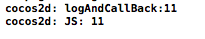

# Cocos2d-x Javascript Binding手动绑定

## 前言

Cocos2d-x内置了一套JavaScript的解析引擎[SpiderMonkey](https://developer.mozilla.org/en-US/docs/Mozilla/Projects/SpiderMonkey?redirectlocale=en-US&redirectslug=SpiderMonkey)，通过SpiderMonkey在引擎内部将C++代码映射为JavaScript代码，从而实现了用JavaScript语法调用Cocos2d-x的API来完成游戏的逻辑的编写。

## 绑定实现

### 一,创建待绑定的类

- XObject.h头文件

```
	typedef void (*XObjectCallFunc)(void *selector, int value);
	class XObject
	{
	public:
    	XObject(void *selector, XObjectCallFunc func);
    	void logAndCallBack(int value);
	private:
    	void *m_selector;
    	XObjectCallFunc m_callback;
	};
```

XObjectCallFunc 定义了一个函数指针，作为回调函数类型。

- XObject.cpp实现

```
	XObject::XObject(void *selector, XObjectCallFunc func)
	{
    	m_selector = selector;
    	m_callback = func;
	}
	void XObject::logAndCallBack(int value)
	{
    	cocos2d::log("logAndCallBack:%d", value);
    	m_callback(m_selector, value);
	}
```

构造函数简单记录回调函数指针和回调对象，在logAndCallBack中会使用到。

### 二,JSB环境初始化

在applicationDidFinishLaunching中使用了很多类似于

```
sc->addRegisterCallback(XXX);
```

形式的语句注册特定模块的js绑定。每一个注册函数，对应一个模块。我们在这注册自己模块的js绑定

```
sc->addRegisterCallback(JSB_register_XObject);
```
	
### 三,实现绑定

添加头文件 **JSB_Manual_XObject.h** ，并在其中声明函数JSB手动绑定注册回调函数

```
void JSB_register_XObject(JSContext* cx, JSObject* obj);
```

接下来我们需要做的就是根据自己的需要在**JSB_Manual_XObject.cpp**中实现绑定,我们需要完成以下几点：

1. 注册一个JS的类
2. 一个JS的类有构造器,析构器以及一个create方法
3. 把C++类中的方法绑定到JS类

先贴上部分代码，然后再做详细解释：

```
//1.
static JSClass* JSB_XObject_class = NULL;
static JSObject* JSB_XObject_object = NULL;
//2.
static void JSB_XObject_finalize(JSFreeOp *fop, JSObject *obj)
{
	CCLOGINFO("jsbindings: finalizing JS object %p (XObject)", obj);
    XObject *newObject = (XObject *)JS_GetPrivate(obj);
    JS_SetPrivate(obj, NULL);
    delete newObject;
}
//3.
static void JSB_XObject_Callback(void *selector, int value)
{
    JSObject *jsobj = (JSObject *)selector;
    jsval param[] = {
        INT_TO_JSVAL(value)
    };
    jsval retval;
    ScriptingCore::getInstance()->executeFunctionWithOwner(OBJECT_TO_JSVAL(jsobj), "callback", 1, param, &retval);
}
//4.
static JSBool JSB_XObject_constructor(JSContext *cx, unsigned argc, JS::Value *vp)
{
    if (argc == 0) {
        JSObject *jsobj = JS_NewObject(cx, JSB_XObject_class, JSB_XObject_object, NULL);
        XObject *newObject = new XObject(jsobj, JSB_XObject_Callback);
        JS_SetPrivate(jsobj, (void *)newObject);
        JS_SET_RVAL(cx, vp, OBJECT_TO_JSVAL(jsobj));
        return JS_TRUE;
    }
    JS_ReportError(cx, "Wrong number of arguments: %d, was expecting: %d", argc, 0);
    return JS_FALSE;
}
//5.
static JSBool JSB_XObject_logAndCallBack(JSContext *cx, uint32_t argc, jsval *vp)
{
    JSB_PRECONDITION2(argc==1, cx, JS_FALSE, "Invalid number of arguments");
    jsval *argvp = JS_ARGV(cx,vp);
    JSObject *jsObj = (JSObject *)JS_THIS_OBJECT(cx, vp);
    XObject *newObject = (XObject *)JS_GetPrivate(jsObj);
    // call native member function
    newObject->logAndCallBack(JSVAL_TO_INT(argvp[0]));  
    JS_SET_RVAL(cx, vp, JSVAL_VOID);
    return JS_TRUE;
}
//6.
static void JSB_XObject_createClass(JSContext *cx, JSObject* globalObj, const char* name)
{
	JSB_XObject_class = (JSClass *)calloc(1, sizeof(JSClass));
	JSB_XObject_class->name = name;
	JSB_XObject_class->addProperty = JS_PropertyStub;
	JSB_XObject_class->delProperty = JS_DeletePropertyStub;
	JSB_XObject_class->getProperty = JS_PropertyStub;
	JSB_XObject_class->setProperty = JS_StrictPropertyStub;
	JSB_XObject_class->enumerate = JS_EnumerateStub;
	JSB_XObject_class->resolve = JS_ResolveStub;
	JSB_XObject_class->convert = JS_ConvertStub;
	JSB_XObject_class->finalize = JSB_XObject_finalize;
	JSB_XObject_class->flags = JSCLASS_HAS_PRIVATE;
    // no property for this class
	static JSPropertySpec properties[] = {
        {0, 0, 0, 0, 0}
	};
    // define member function
	static JSFunctionSpec funcs[] = {
		JS_FN("logAndCallBack", JSB_XObject_logAndCallBack, 1, JSPROP_PERMANENT  | JSPROP_ENUMERATE),
		JS_FS_END
	};
	static JSFunctionSpec st_funcs[] = {
		JS_FS_END
	};
	JSB_XObject_object = JS_InitClass(
                                     cx,
                                     globalObj,
                                     NULL,  //parent proto
                                     JSB_XObject_class,
                                     JSB_XObject_constructor,
                                     0,
                                     properties,
                                     funcs, 
                                     NULL,  //no static properties
                                     st_funcs);   
}
//7.
void JSB_register_XObject(JSContext *cx, JSObject *obj)
{
    // define name space
    JSObject *myBinding = JS_NewObject(cx, NULL, NULL, NULL);
    JS::RootedValue myBindingVal(cx);
    myBindingVal = OBJECT_TO_JSVAL(myBinding);
	JS_SetProperty(cx, obj, "MyBinding", myBindingVal);
    // register class
    JSB_XObject_createClass(cx, myBinding, "XObject");
}
```

1. 定义JS端的类型，在下方创建新对象时会用到。

2. 这是JS的析构函数，在析构函数中对新创建对象进行清除。

3. JS端回调方法，我们可以使用这个方法来调用c++端的回调方法。这里有几个接口需要解释下:
	- INT_TO_JSVAL(value)可将**C**风格的整型值value转换为**Js**的整型值；
	
	- executeFunctionWithOwner简化了调用对象**OBJECT_TO_JSVAL(jsobj)**的**callback**方法的过程,**1**为参数个数,**param**为参数数组名,**retval**接受函数返回值。
	
```
	ScriptingCore::getInstance()->executeFunctionWithOwner(OBJECT_TO_JSVAL(jsobj), "callback", 1, param, &retval);
```

4. JS的构造函数：
	
	利用[**JS_NewObject**](https://developer.mozilla.org/en-US/docs/SpiderMonkey/JSAPI_Reference/JS_NewObject)创建了对象。JS_NewObject基于一个特定的类(此处为**JSB_XObject_class**),原型(**JSB_XObject_object**)以及指向父类的指针来创建对象。    

	同时创建了一个**XObject**的对象，参数为JS对象和JS端的回调函数。再回过头看看**XObject**类，不难发现JS端的回调方法已经和C++的回调方法已经被绑定
	
	**JS_SetPrivate**被用来设置对象(**jsobj**)的私有数据域(**(void *****)newObject**)，这个方法被用来存储不能在脚本中直接可见的c/c++的数据时非常有用。但是，**需要注意**的是此处的对象必须是一个包含有**JSCLASS_HAS_PRIVATE flag** 的实例。

5. JSB_XObject_logAndCallBack 用来绑定C++的 logAndCallBack。

6. 创建了一个JS对象，并为其分配空间

```
	JSB_XObject_class = (JSClass *)calloc(1, sizeof(JSClass));
```

然后通过该对象来描述用户信息：**name**为被绑定的类的名称,**finalize**接收JS的析构函数；
	
**JSPropertySpec**被用来给对象定义一个属性：
	
```
	struct JSPropertySpec {
  	const char *name;  //Name to assign the property.
  	int8 tinyid;  //Unique ID number for the property
  	uint8 flags;  //Property attributes.
  	JSPropertyOp getter;    //Getter method for the property.
  	JSPropertyOp setter;    //Setter method for the property.
	};
```

   同时还定义了静态成员funcs和st_funcs。**JSFunctionSpec**为JS函数定义了特性与对象进行关联。
   
```
   struct JSFunctionSpec {
    const char      *name;  //function's name
    JSNativeWrapper call;   //The built-in JS call wrapped by this function
    uint16_t        nargs;  //value used for Function.length
    uint16_t        flags;  //The bitwise OR of any number of property attributes and function flags, and optionally JSFUN_STUB_GSOPS.
    const char      *selfHostedName; 
   };
```
   
   **JS_InitClass**初始化一个JSClass。第八个参数**const JSFunctionSpec *****fs**(对应于代码中的参数**funcs**)。这个参数是指向**JSFunctionSpecs**数组第一个元素的指针，这些如果存在就会被添加到类的新原型对象。这个新类的所有实例将通过原型链继承这些方法。这些方法在javascript中的地位就相当于C++和Java中公有的非静态方法。
   
7. 注册回调函数实现：

下面的代码将值myBindingVal指派给对象obj的MyBinding属性，定义了一个js名称空间MyBinding。

```
JS_SetProperty(cx, obj, "MyBinding", myBindingVal);
```

然后在这个名字空见下新加入一个类名：

```
JSB_XObject_createClass(cx, myBinding, "XObject");
```

更多**JS API**信息，参考[JSAPI](https://developer.mozilla.org/en-US/docs/SpiderMonkey/JSAPI_User_Guide)。

### 四,测试

打开**Resources/res**文件夹下的**myApp.js**文件。在**MyScene**的**onEnter**方法中添加如下代码：

```
var MyScene = cc.Scene.extend({
    ctor:function() {
        this._super();
        cc.associateWithNative( this, cc.Scene );
    },
    onEnter:function () {
        this._super();
        var layer = new MyLayer();
        this.addChild(layer);
        layer.init();                        
        // test myBinding
        var obj = new MyBinding.XObject();
        obj.callback = function (value) {
                                 cc.log(value);
                              };
        obj.logAndCallBack(11);
    }
});
```

如果绑定成功，将会获得如下显示：

