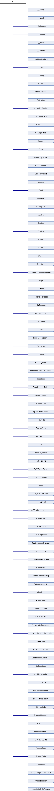

#内存管理


##Cocos2d-x的内存管理机制概述

在3.0版本，Cocos2d-x采用全新的根类Ref，实现Cocos2d-x 类对象的引用计数记录。引擎中的所有类都派生自Ref。 基本类图：




Cocos2d-x中所有继承自Ref的类，都可以使用Cocos2d-x的内存管理。
Cocos2d-x 提供引用计数管理内存。调用retain()方法，令其引用计数增1，表示获取该对象的引用权；在引用结束的时候调用release()方法，令其引用计数值减1，表示释放该对象的引用权。

通过调用autorelease()方法，将对象放入自动释放池。当释放池自身被释放的时候，它就会对池中的所有对象执行一次release()方法，实现灵活的垃圾回收。

Cocos2d-x 提供AutoreleasePool，管理自动释放对象。当释放池自身被释放的时候，它就会对池中的所有对象执行一次release()方法。

##retain 和 release 使用

下面一段简单的例子来学习 retain 和 release的使用

```
    TestObject *obj1 = new TestObject("testobj1");
    CCLOG("obj1 referenceCount=%d",obj1->getReferenceCount());
    obj1->retain();
    CCLOG("obj1 referenceCount=%d",obj1->getReferenceCount());
    obj1->release();
    CCLOG("obj1 referenceCount=%d",obj1->getReferenceCount());
    obj1->release();
```
控制台显示的日志如下：

```
cocos2d: TestObject:testobj1 is created
cocos2d: obj1 referenceCount=1
cocos2d: obj1 referenceCount=2
cocos2d: obj1 referenceCount=1
cocos2d: TestObject:testobj1 is destroyed
```

通过例子和打印结果可以看到，obj1对象创建后，引用计数为1；执行一次retain()后，引用计数为2；执行一次release()后，引用计数回到1；再执行一次release()后，对象会被释放掉。

因此，我们可以调用retain()方法，令其引用计数增1，表示获取该对象的引用权；在引用结束的时候调用release()方法，令其引用计数值减1，表示释放该对象的引用权。直到对象的引用计数为0，释放该对象。


## autorelease 使用

同样一段简单的例子来学习autorelease的使用，代码如下：

```
    TestObject *obj = new TestObject("testobj");
    CCLOG("obj referenceCount=%d",obj->getReferenceCount());
    obj->autorelease();
    CCLOG("obj is add in currentpool %s",PoolManager::getInstance()->getCurrentPool()->contains(obj)?"true":"false");
    CCLOG("obj referenceCount=%d",obj->getReferenceCount());
    obj->retain();
    CCLOG("obj referenceCount=%d",obj->getReferenceCount());
    obj->release();
    CCLOG("obj referenceCount=%d",obj->getReferenceCount());
    
    //obj in current pool will be release
    Director::getInstance()->replaceScene(this);
```

控制台显示的日志如下：

```
cocos2d: TestObject:testobj is created
cocos2d: obj referenceCount=1
cocos2d: obj is add in currentpool true
cocos2d: obj referenceCount=1
cocos2d: obj referenceCount=2
cocos2d: obj referenceCount=1
...
cocos2d: TestObject:testobj is destroyed
```
通过代码和打印结果，我们可以看到，obj对象创建后，引用计数为1；执行一次autorelease()后，obj对象被加入到当前的自动释放池。obj对象的引用计数值并没有减1。但是在下一帧开始前，当前的自动释放池会被回收掉，并对自动释放池中的所有对象执行一次release()操作，当对象的引用计数为0时，对象会被释放掉。

obj对象执行autorelease()后，我们对其执行了一组retain()和release()操作。此时obj对象的引用计数为1，在场景切换后，当前的自动释放池被回收，obj对象执行一次release()操作引用计数减为0时，对象会被释放掉。

注意：autorelease()只有在自动释放池被释放时才会进行一次释放操作，如果对象释放的次数超过了应有的次数，则这个错误在调用autorelease()时并不会被发现，只有当自动释放池被释放时（通常也就是游戏的每一帧结束时），游戏才会崩溃。在这种情况下，定位错误就变得十分困难了。例如，在游戏中，一个对象含有1个引用计数，但是却被调用了两次autorelease()。在第二次调用autorelease()时，游戏会继续执行这一帧，结束游戏时才会崩溃，很难及时找到出错的地点。

因此，我们建议在开发过程中应该避免滥用autorelease()，只在工厂方法等不得不用的情况下使用，尽量以release()来释放对象引用。

## AutoreleasePool 使用
Cocos2d-x提供AutoreleasePool，管理自动释放对象。
下面一段简单的例子讲解AutoreleasePool的使用，代码如下：

```
    TestObject *obj2 = new TestObject("testobj2");
    CCLOG("obj2 referenceCount=%d",obj2->getReferenceCount());
    //use AutoreleasePool
    {
        AutoreleasePool pool;
        obj2->retain();
        CCLOG("obj2 referenceCount=%d",obj2->getReferenceCount());
        obj2->release();
        CCLOG("obj2 referenceCount=%d",obj2->getReferenceCount());
        obj2->autorelease();
        CCLOG("obj2 is add in pool %s",pool.contains(obj2)?"true":"false");
        TestObject *obj3 = new TestObject("testobj3");
        obj3->autorelease();
        CCLOG("obj3 is add in pool %s",pool.contains(obj3)?"true":"false");
    }
```

```
cocos2d: TestObject:testobj2 is created
cocos2d: obj2 referenceCount=1
cocos2d: obj2 referenceCount=2
cocos2d: obj2 referenceCount=1
cocos2d: obj2 is add in pool true
cocos2d: TestObject:testobj3 is created
cocos2d: obj3 is add in pool true
cocos2d: TestObject:testobj2 is destroyed
cocos2d: TestObject:testobj3 is destroyed
```

通过代码和输出结果，可以看到，创建了一个obj2对象，此时obj2对象的引用计数为1。接着创建了一个自动释放池，对obj2对象执行retain()和release()操作后，执行autorelease()操作，此时obj2对象被加入到当前新建的自动释放池中。接着新建了obj3对象，并执行autorelease()操作。同样obj3也被加入到当前新建的自动释放池中。在代码块结束后，自动释放池被回收，加入自动释放池中的对象obj2和obj3执行release()操作，引用计数减为0，被释放销毁。

我们可以自己创建AutoreleasePool，管理对象的autorelease。

我们已经知道，调用了autorelease()方法的对象（下面简称"autorelease对象"），将会在自动释放池释放的时候被释放一次。虽然，Cocos2d-x已经保证每一帧结束后释放一次释放池，并在下一帧开始前创建一个新的释放池，但是我们也应该考虑到释放池本身维护着一个将要执行释放操作的对象列表，如果在一帧之内生成了大量的autorelease对象，将会导致释放池性能下降。因此，在生成autorelease对象密集的区域（通常是循环中）的前后，我们最好可以手动创建并释放一个回收池。

例如：

```
    // example of using temple autorelease pool
    {
        AutoreleasePool pool2;
        char name[20];
        for (int i = 0; i < 100; ++i)
        {
            snprintf(name, 20, "object%d", i);
            TestObject *tmpObj = new TestObject(name);
            tmpObj->autorelease();
        }
    }
```
autorelease()的实质是将对象加入自动释放池，对象的引用计数不会立刻减1，在自动释放池被回收时对象执行release()；autorelease()并不是毫无代价的，其背后的释放池机制同样需要占用内存和CPU资源。过多的使用autorelease()会增加自动释放池的管理和释放池维护对象存取释放的支出。在内存和CPU资源本就不足的程序中使得系统资源更加紧张。此时就需要我们合理创建自动释放池管理对象autorelease。不用的对象推荐使用release()来释放对象引用，立即回收。

## 特殊内存管理
* 工厂方法

在Cocos2d-x中，提供了大量的工厂方法创建对象。仔细看你会发现，这些对象都是自动释放的。下面以label的create方法为例，代码如下：

```
Label* Label::create()
{
    auto ret = new Label();

    if (ret)
    {
        ret->autorelease();
    }

    return ret;
}
```
我们可以发现，创建了一个Label的对象，并对该对象执行autorelease()。表示该对象是自动释放的。细心的你会发放Layer/Scene/Sprite等类的create方法都相同。

使用工厂方法创建对象时，虽然引用计数也为1，但是由于对象已经被放入了释放池，因此调用者没有对该对象的引用权，除非我们人为地调用了retain()来获取引用权，否则，不需要主动释放对象。

* Node的addChild/removeChild方法

在Cocos2d-x中，所有继承自Node类，在调用addChild方法添加子节点时，自动调用了retain。
对应的通过removeChild，移除子节点时，自动调用了release。

调用addChild方法添加子节点，节点对象执行retain。子节点被加入到节点容器中，父节点销毁时，会销毁节点容器释放子节点。对子节点执行release。如果想提前移除子节点我们可以调用removeChild。

在Cocos2d-x内存管理中，大部分情况下我们通过调用addChild/removeChild的方式自动完成了retain,release调用。不需再调用retain,release。

## 总结

使用Cocos2d-x的内存管理，要清楚当前对象的引用计数。 使用者对对象进行retain和release成对使用。 正确使用autorelease方法。灵活使用自动释放池管理一些autorelease对象密集的区域。


