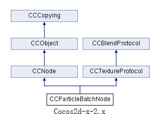
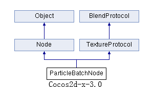
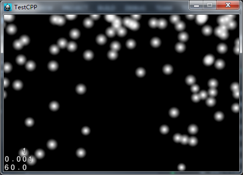

##Cocos2d-x v2.x 와 v3.x 의 파티클 시스템 비교
---
###CCParticleBatchNode & ParticleBatchNode
###*공통점:*
####상속 다이어그램

   

양 클래스 모두 Node(v2.x의 경우 CCNode) 와 TextureProtocol(v2.x의 경우 CCTextureProtocol) 를 상속받습니다.

(**주의:** 이제부터, v3.x 방식의 표기법을 사용할 것입니다. 즉, 클래스 명에서 **CC** 접두어를 사용하지 않을 것입니다.)

ParticleBatchNode 는 배치노드와 비슷합니다: 한 번의 OpenGL 호출로 모든 자식 노드를 그립니다("batch draw"라고 알려져 있죠).

하나의 ParticleBatchNode 는 오직 하나의 이미지나 텍스쳐만을 참조할 수 있습니다. 그리고, 해당 이미지나 텍스쳐만을 포함한 ParticleSystems 만이 ParticleBatchNode 에 추가될 수 있습니다.

모든 ParticleSystem 은 한 번의 OpenGL ES 호출에 그려지는 ParticleBatchNode 에 추가됩니다.

**경고: ParticleSystem들을 ParticleBatchNode에 추가하지 않을 경우, 각 ParticleSystem 마다 OpenGL ES 호출이 필요하기 때문에 성능이 저하됩니다.**

###*차이점:*

-  더 이상 'CC' 접두어를 사용하지 않습니다.
-  C++11의 새로운 키워드인 'override' 가 많이 사용되었습니다. 예:
	``` virtual void addChild(Node * child) override; ```
-  Director의 싱글톤 객체를 얻기 위해 ```CCDirector::shareDirector() ``` 대신 ``` Director::getInstance()``` 를 사용합니다.
-  TextureCache에 이미지를 추가하려면 이제 ``` Director::getInstance()->getTextureCache()->addImage(const std::string &path) ``` 를 사용해야 합니다.
-  3.x 버전에서는 구버전에서 쓰이던 ```CC_SYNTHESIZE(CCTextureAtlas*, m_pTextureAtlas, TextureAtlas); ``` 매크로 함수 대신, ``` getTextureAtlas()``` 와 ```setTextureAtlas(TextureAtlas* atlas)``` 와 같은 인라인 함수들을 사용합니다. 
-  2.x 버전의 ``` objectAtIndex(unsigned int index);``` 와 같은 함수명들이 3.x 버전에서는 ```getObjectAtIndex(long index); ``` 와 같이 변경되었습니다.
-  두 개의 매크로로 정의된 상수들을 하나로 정리하였습니다. 3.x의 ``` BlendFunc::ALPHA_NON_PREMULTIPLIED ``` 는 아래와 같이 정의되어 있습니다:
``` const BlendFunc BlendFunc::ALPHA_NON_PREMULTIPLIED = {GL_SRC_ALPHA, GL_ONE_MINUS_SRC_ALPHA}; ```
. ``` GL_SRC_ALPHA``` 와 ```GL_ONE_MINUS_SRC_ALPHA``` 를 사용했던 2.x보다 간단합니다. 3.x에는 ```BlendFunc::ALPHA_PREMULTIPLIED``` 도 있는데, 이는 2.x의 ```CC_BLEND_SRC``` 와 ```CC_BLEND_DST ``` 를 대체합니다.


---
###CCParticleSystem & ParticleSystem
###*공통점:*
####상속 다이어그램

	

파티클 시스템의 부모 클래스들. 
파티클 시스템의 속성들:

- emission rate of the particles
- Gravity Mode (Mode A):
- gravity
- direction
- speed +- variance
- tangential acceleration +- variance
- radial acceleration +- variance
- Radius Mode (Mode B):
- startRadius +- variance
- endRadius +- variance
- rotate +- variance
- Properties common to all modes:
- life +- life variance
- start spin +- variance
- end spin +- variance
- start size +- variance
- end size +- variance
- start color +- variance
- end color +- variance
- life +- variance
- blending function
- texture

Cocos2d 는 [Particle Designer](http://particledesigner.71squared.com/) 를 사용해 생성한 파티클을 지원합니다.

Particle Designer의 'Radius Mode' 는 입자의 방출량을 초당 30 개로 고정해놓았습니다. cocos2d는 이와는 약간 다른 접근방법을 취하기에 해당 모드에서 정확히 동일하게 보이지 않을 수 있습니다. 하지만 대부분의 결과물들은 거의 비슷하게 보입니다.

Cocos2d-x 는 Particle Designer 에서 사용된 모든 변수들에 더불어 몇 가지 추가적인 옵션들도 제공합니다:

- spinning particles (ParticleSystemQuad에서 사용 가능합니다)
- tangential acceleration (Gravity mode)
- radial acceleration (Gravity mode)
- radius direction (Radius mode) (Particle Designer 는 안쪽에서 바깥쪽으로 향하는 것만을 지원합니다.)

위에서 언급한 모든 속성들은 아래와 같이 런타임에서 동적으로 변화시킬 수 있습니다.

``` emitter.radialAccel = 15; ```
``` emitter.startSpin = 0; ```

###차이점:
|*Cocos2d-x-2.x*|*Cocos2d-x-3.x*|
|---------------|---------------|
|` kCCParticleDefaultCapacity `|` kParticleDefaultCapacity `|
|` ParticleSystem::Mode kCCParticleModeGravity `|` ParticleSystem::Mode::GRAVITY `
|` ParticleSystem::Mode kCCParticleModeRadius `|` ParticleSystem::Mode::RADIUS `|
|N/A|` typedef ParticleSystem::PositionType tPositionType `|
|` kCCPositionTypeFree ` / ` kPositionTypeFree `|` ParticleSystem::PositionType::FREE `|
|` kCCPositionTypeRelative ` / ` kPositionTypeRelative ` |` ParticleSystem::PositionType::RELATIVE `|
|` kCCPositionTypegRrouped ` / ` kPositionTypegRrouped `|` ParticleSystem::PositionType::GROUPED `|
|` kCCParticleDurationInfinity ` / ` kParticleDurationInfinity `|` ParticleSystem::DURATION_INFINITY `|
|` kCCParticleStartSizeEqualToEndSize ` / ` kParticleStartSizeEqualToEndSize `|` ParticleSystem::START_SIZE_EQUAL_TO_END_SIZE `|
|` kCCParticleStartRadiusEqualToEndRadius ` / ` kParticleStartRadiusEqualToEndRadius `|` ParticleSystem::START_RADIUS_EQUAL_TO_END_RADIUS `|

- ``` CC_PROPERTY(varType, varName, funName)```  나 ```CC_PROPERTY_READONLY(varType, varName, funName) ```과 같은 지저분한 매크로들을 헤더파일에 정의한 20개가 넘는 인라인 함수들로 모두 대체하였습니다.

|*Cocos2d-x-2.x*|*Cocos2d-x-3.x*|
|---------------|---------------|
|` CC_PROPERTY(int, m_nEmitterMode, EmitterMode) `|`Mode _emitterMode;`	`inline Mode getEmitterMode() const { return _emitterMode; };`	`inline void setEmitterMode(Mode mode) { _emitterMode = mode; };`|
|` CC_PROPERTY(CCParticleBatchNode*, m_pBatchNode, BatchNode) `|`ParticleBatchNode* _batchNode;`	`virtual ParticleBatchNode* getBatchNode() const;`	`virtual void setBatchNode(ParticleBatchNode* batchNode);`|
|` CC_PROPERTY_READONLY(unsigned int, m_uParticleCount, ParticleCount) `|`int _particleCount;`	`inline unsigned int getParticleCount() const { return _particleCount; };`|
|` CC_PROPERTY(float, m_fDuration, Duration) `|`float _duration;`	`inline float getDuration() const { return _duration; };`	`inline void setDuration(float duration) { _duration = duration; };`|
|` CC_PROPERTY_PASS_BY_REF(CCPoint, m_tSourcePosition, SourcePosition) `|`Point _sourcePosition;`	`inline const Point& getSourcePosition() const { return _sourcePosition; };`	`inline void setSourcePosition(const Point& pos) { _sourcePosition = pos; };`|
|` CC_PROPERTY_PASS_BY_REF(CCPoint, m_tPosVar, PosVar) `|`Point _posVar;`	`inline const Point& getPosVar() const { return _posVar; };`	`inline void setPosVar(const Point& pos) { _posVar = pos; };`|
|` CC_PROPERTY(float, m_fLife, Life) `|`float _life;`	`inline float getLife() const { return _life; };`	`inline void setLife(float life) { _life = life; };`|
|` CC_PROPERTY(float, m_fLifeVar, LifeVar) `|`float _lifeVar;`	`inline float getLifeVar() const { return _lifeVar; };`	`inline void setLifeVar(float lifeVar) { _lifeVar = lifeVar; };`|
|` CC_PROPERTY(float, m_fAngle, Angle) `|`float _angle;`	`inline float getAngle() const { return _angle; };`	`inline void setAngle(float angle) { _angle = angle; };`|
|` CC_PROPERTY(float, m_fAngleVar, AngleVar) `|`float _angleVar;`	`inline float getAngleVar() const { return _angleVar; };`	`inline void setAngleVar(float angleVar) { _angleVar = angleVar; };`|
|` CC_PROPERTY(float, m_fStartSize, StartSize) `|`float _startSize;`	`inline float getStartSize() const { return _startSize; };`	`inline void setStartSize(float startSize) { _startSize = startSize; };`|
|` CC_PROPERTY(float, m_fStartSizeVar, StartSizeVar) `|`float _startSizeVar;`	`inline float getStartSizeVar() const { return _startSizeVar; };`	`inline void setStartSizeVar(float sizeVar) { _startSizeVar = sizeVar; };`|
|` CC_PROPERTY(float, m_fEndSize, EndSize) `|`float _endSize;`	`inline float getEndSize() const { return _endSize; };`	`inline void setEndSize(float endSize) { _endSize = endSize; };`|
|` CC_PROPERTY(float, m_fEndSizeVar, EndSizeVar) `|`float _endSizeVar;`	`inline float getEndSizeVar() const { return _endSizeVar; };`	`inline void setEndSizeVar(float sizeVar) { _endSizeVar = sizeVar; };`|
|` CC_PROPERTY_PASS_BY_REF(ccColor4F, m_tStartColor, StartColor) `|`Color4F _startColor;`	`inline const Color4F& getStartColor() const { return _startColor; };`	`inline void setStartColor(const Color4F& color) { _startColor = color; };`|
|` CC_PROPERTY_PASS_BY_REF(ccColor4F, m_tStartColorVar, StartColorVar) `|`Color4F _startColorVar;`	`inline const Color4F& getStartColorVar() const { return _startColorVar; };`	`inline void setStartColorVar(const Color4F& color) { _startColorVar = color; };`|
|` CC_PROPERTY_PASS_BY_REF(ccColor4F, m_tEndColorVar, EndColorVar) `|`Color4F _endColorVar;`	`inline const Color4F& getEndColor() const { return _endColor; };`	`inline void setEndColor(const Color4F& color) { _endColor = color; };`|
|` CC_PROPERTY(float, m_fStartSpin, StartSpin) `|`float _startSpin;`	`inline float getStartSpin() const { return _startSpin; };`	`inline void setStartSpin(float spin) { _startSpin = spin; };`|
|` CC_PROPERTY(float, m_fStartSpinVar, StartSpinVar) `|`float _startSpinVar;`	`inline float getStartSpinVar() const { return _startSpinVar; };`	`inline void setStartSpinVar(float pinVar) { _startSpinVar = pinVar; };`|
|` CC_PROPERTY(float, m_fEndSpin, EndSpin) `|`float _endSpinVar;`	`inline float getEndSpin() const { return _endSpin; };`	`inline void setEndSpin(float endSpin) { _endSpin = endSpin; };`|
|` CC_PROPERTY(float, m_fEndSpinVar, EndSpinVar) `|`float _endSpinVar;`	`inline float getEndSpinVar() const { return _endSpinVar; };`	`inline void setEndSpinVar(float endSpinVar) { _endSpinVar = endSpinVar; };`|
|` CC_PROPERTY(float, m_fEmissionRate, EmissionRate) `|`float _emissionRate;`	`inline float getEmissionRate() const { return _emissionRate; };`	`inline void setEmissionRate(float rate) { _emissionRate = rate; };`|
|` CC_PROPERTY(unsigned int, m_uTotalParticles, TotalParticles) `|`int _totalParticles;`	`virtual int getTotalParticles() const;`	`virtual void setTotalParticles(int totalParticles);`|
|` CC_PROPERTY(CCTexture2D*, m_pTexture, Texture) `|`Texture2D* _texture;`	`virtual Texture2D* getTexture() const override;`	`virtual void setTexture(Texture2D *texture) override;`|
|` CC_PROPERTY(ccBlendFunc, m_tBlendFunc, BlendFunc) `|`BlendFunc _blendFunc;`	`virtual void setBlendFunc(const BlendFunc &blendFunc) override;`	`virtual const BlendFunc &getBlendFunc() const override;`|
|` CC_PROPERTY(bool, m_bOpacityModifyRGB, OpacityModifyRGB) `|`bool _opacityModifyRGB;`	`inline void setOpacityModifyRGB(bool opacityModifyRGB) { _opacityModifyRGB = opacityModifyRGB; };`	`inline bool isOpacityModifyRGB() const { return _opacityModifyRGB; };`	`CC_DEPRECATED_ATTRIBUTE inline bool getOpacityModifyRGB() const { return isOpacityModifyRGB(); }`|
|` CC_PROPERTY(tCCPositionType, m_ePositionType, PositionType) `|`PositionType _positionType;`	`inline PositionType getPositionType() const { return _positionType; };`	`inline void setPositionType(PositionType type) { _positionType = type; };`|
|` CC_SYNTHESIZE(unsigned int, m_uAtlasIndex, AtlasIndex) `|`int _atlasIndex;` `inline int getAtlasIndex() const { return _atlasIndex; };`	`inline void setAtlasIndex(int index) { _atlasIndex = index; };`|

- 3.x 버전에서는 ``` std::string _configName;``` 과 ```int _yCoordFlipped; ``` 을 추가적으로 제공합니다.


---
###CCParticleSystemQuad & ParticleSystemQuad
###*공통점:*
####상속 다이어그램

	

ParticleSystemQuad 은 ParticleSystem 의 자식 클래스입니다.
따라서, ParticleSystem 의 모든 기능들을 사용할 수 있습니다.
추가 기능 및 제한된 기능:

- Particle 크기에 float number를 할당할 수 있습니다.
- scale을 변화시킬 수 있습니다.
- 입자들을 회전시킬 수 있습니다.
- subrects 를 지원합니다.
- 1.1 부터, batched rendering 을 지원합니다.(위에서 자세히 기술함)

###차이점:

3.x과 비교해 별 차이가 없습니다. 2.x과 똑같이 사용하시면 됩니다. 더 자세히 알아보고 싶으시면 [여기](http://cocos2d-x.org/wiki/Reference) 를 참고하세요.


###*예제:*
- 파티클 시스템을 사용해 만든 샘플입니다.:



	/*
		// Cocos2d-x-2.x
		CCSize size = CCDirector::sharedDirector()->getWinSize();
		ParticleSystemQuad* m_emitter = ParticleSystemQuad::createWithTotalParticles(900);
		m_emitter->setTexture(CCTextureCache::sharedTextureCache()->addImage("fire.png"));
	*/
		// Cocos2d-x-3.x
		auto size = Director::getInstance()->getWinSize();
		auto m_emitter = ParticleSystemQuad::createWithTotalParticles(900);
		m_emitter->setTexture(Director::getInstance()->getTextureCache()->addImage("fire.png"));
	
		//The code below we can use both in 2.x and 3.x 
		m_emitter->setDuration(-1);
		m_emitter->setGravity(Point(0, -240));  // in Cocos2d-x-2.x CCPoint(0, -240) is used
		m_emitter->setAngle(90);
		m_emitter->setAngleVar(360);
		m_emitter->setRadialAccel(50);
		m_emitter->setRadialAccelVar(0);
		m_emitter->setTangentialAccel(30);
		m_emitter->setTangentialAccelVar(0);
		m_emitter->setPosition(Point(size.width / 2, size.height));
		m_emitter->setPosVar(Point(400, 0));
		m_emitter->setLife(4);
		m_emitter->setLifeVar(2);
		m_emitter->setStartSpin(30);
		m_emitter->setStartSpinVar(60);
		m_emitter->setEndSpin(60);
		m_emitter->setEndSpinVar(60);
		m_emitter->setStartColor(Color4F(255,255,255,1));
		m_emitter->setStartColorVar(Color4F(0,0,0,0));
		m_emitter->setEndColor(Color4F(255, 255, 255, 1));
		m_emitter->setEndColorVar(Color4F(0, 0, 0, 0));
		m_emitter->setStartSize(30);
		m_emitter->setStartSizeVar(0);
		m_emitter->setEndSize(20.0f);
		m_emitter->setEndSizeVar(0);
		m_emitter->setEmissionRate(100);
		addChild(m_emitter,10);

- ParticleExplosion, ParticleFire, ParticleFireworks, ParticleFlower, ParticleGalaxy, ParticleMeteor, ParticleRain, ParticleSmoke, ParticleSnow, ParticleSpiral, ParticleSun 클래스들은 위의 클래스들을 상속받아 만든 예제들이며, Cocos2d-x 내부에 기본적으로 포함되어 있습니다. 이 클래스들을 참고해 조금만 수정해도 멋진 결과물들을 만드실 수 있을것입니다. 물론, 수정 없이 그대로 사용해도 됩니다.

