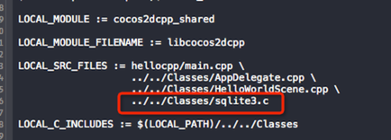

#SQLite集成与用法#

##概述

在Cocos2d-x中，简单数据存储，可以使用UserDefault。那么如何存储大量，不规则的数据？我们可以使用SQLite数据库存储数据。SQLite是使用非常广泛的嵌入式数据库，它有小巧 ,高效,跨平台,开源免费和易操作的特点。

SQLite数据库是使用C语言来编写的，那么在Cocos2d-x使用SQLite也是得心应手。


##准备

首先创建一个Cocos2d-x v3.x的helloworld工程，我们将以该工程作为SQLite集成与用法的实战工程。

打开终端，使用如下命令新建工程：

```
cocos new HelloWorld -p com.your_company.HelloWorld -l cpp 

```
按照上面的操作，我们新建了一个Cocos2d-x v3.x的HelloWorld工程。


###iOS/Mac

iOS/Mac的系统库自带sqlite库,我们只需添加libsqlite3.0.dylib库即可。


###Android

Android系统没有自带sqlite库，我们需要手动添加。

1.下载sqlite包

下载地址：[http://www.sqlite.org/download.html](http://www.sqlite.org/download.html)
下载后，在项目中导入sqlite3.c和sqlite3.h两个文件即可。

2.导入到工程


3.修改Android.mk




##使用SQLite

打开HelloWorldScene.cpp文件，我们在里面加入SQLite的使用示例

引入头文件

```
#include "sqlite3.h"
```

###创建SQLite 数据库

```
    sqlite3 *pdb=NULL;//1
    std::string path= FileUtils::getInstance()->getWritablePath()+"save.db";//2
    
    std::string sql;
    int result;
    result=sqlite3_open(path.c_str(),&pdb);//3
    if(result!=SQLITE_OK)
    {
        log("open database failed,  number%d",result);
    }
```

1. 数据库指针
2. 指定数据库的路径
3. 打开一个数据库，如果该数据库不存在，则创建一个数据库文件 

###SQL语句

```
	sql="create table student(ID integer primary key autoincrement,name text,sex text)";//1
```

1. 创建表的SQL语句

###创建Table

```
    result=sqlite3_exec(pdb,sql.c_str(),NULL,NULL,NULL);//1
    if(result!=SQLITE_OK)
        log("create table failed");
```

1. 创建表

###插入数据

```
    sql="insert into student  values(1,'student1','male')";
    result=sqlite3_exec(pdb,sql.c_str(),NULL,NULL,NULL);
    if(result!=SQLITE_OK)
        log("insert data failed!");
    
    sql="insert into student  values(2,'student2','female')";
    result=sqlite3_exec(pdb,sql.c_str(),NULL,NULL,NULL);
    if(result!=SQLITE_OK)
        log("insert data failed!");
    
    sql="insert into student  values(3,'student3','male')";
    result=sqlite3_exec(pdb,sql.c_str(),NULL,NULL,NULL);
    if(result!=SQLITE_OK)
        log("insert data failed!");
        
```

1. 向表中插入3条数据

###查询

```
    char **re;//查询结果
    int r,c;//行,列
    sqlite3_get_table(pdb,"select * from student",&re,&r,&c,NULL);//1
    log("row is %d,column is %d",r,c);
    
    for(int i=1;i<=r;i++)//2
    {
        for(int j=0;j<c;j++)
        {
            log("%s",re[i*c+j]);
        }
    }
    sqlite3_free_table(re);
```

1. 查询表中的数据
2. 将查询结果的log输出

查询结果：

```
cocos2d: row is 3,column is 3
cocos2d: 1
cocos2d: student1
cocos2d: male
cocos2d: 2
cocos2d: student2
cocos2d: female
cocos2d: 3
cocos2d: student3
cocos2d: male
```
我们可以看到查询到结果和我们前面插入的数据一样。

###删除

```
    sql="delete from student where ID=1";
    result=sqlite3_exec(pdb,sql.c_str(), NULL,NULL,NULL);//1
    if(result!=SQLITE_OK)
        log("delete data failed!");
```

1. 删除ID=1的学生

使用上面的查询语句查询删除ID=1的学生后的数据

查询结果：

```
cocos2d: row is 2,column is 3
cocos2d: 2
cocos2d: student2
cocos2d: female
cocos2d: 3
cocos2d: student3
cocos2d: male
```

我们可以看到，表中ID=1的数据已经被删除了


###注意：

使用sqlite一定要注意的内存管理问题，那就是打开数据库之后，数据操作完成之后，一定要关闭数据库，否侧会造成内存泄漏。

```
sqlite3_close(pdb);
```

##数据文件存放的位置

* Android：

```
	/data/data/com.youCompany.Helloworld/files/save.db
```

* iOS:

位于程序沙盒的文档目录下
```
../Documents/save.db
```

