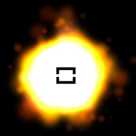
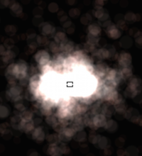

# 粒子系统

粒子系统是指计算机图形学中模拟特定现象的技术，它在模仿自然现象、物理现象及空间扭曲上具备得天独厚的优势，能为我们实现一些真实自然而又带有随机性的效果（如爆炸、烟花、水流）提供了方便。Cocos2d-x引擎中就为我们提供了强大的粒子系统

下面是使用粒子系统完成的两个粒子特效:

   

## 创建粒子特效的工具

尽管你能手动创建粒子特效, 按照喜好确定每个属性, 但是使用工具往往更方便高效. 下面介绍几个第三方工具:

1. [Particle Designer](https://71squared.com/particledesigner):  Mac 上一款非常强大的粒子特效编辑器
2. [V-play particle editor](http://v-play.net/2014/02/v-play-particle-editor-for-cocos2d-and-v-play/): 一款跨平台的粒子特效编辑器
3. [Particle2dx](http://www.effecthub.com/particle2dx): 一款 Web 粒子特效编辑器, 打开网页即可进行设计

使用这些工具完成粒子特效的设计, 最终会导出一个 _.plist_ 文件,  Cocos2d-x 通过使用这种文件, 就能把粒子特效添加到场景中, 添加方法和操作一个普通的节点类型一样

创建方法:


// create by plist file
auto particleSystem = ParticleSystem::create("SpinningPeas.plist");


## 内置粒子特效

准备好添加粒子特效到你的游戏中了吗? 是否习惯创建自定义粒子特效? 不习惯也没关系, 我们内置了一些粒子特效, 你可以直接使用. 这个列表都是:

  >-ParticleFire: Point particle system. Uses Gravity mode.

  >-ParticleFireworks: Point particle system. Uses Gravity mode.

  >-ParticleSun: Point particle system. Uses Gravity mode.

  >-ParticleGalaxy: Point particle system. Uses Gravity mode.

  >-ParticleFlower: Point particle system. Uses Gravity mode.

  >-ParticleMeteor: Point particle system. Uses Gravity mode.

  >-ParticleSpiral: Point particle system. Uses Gravity mode.

  >-ParticleExplosion: Point particle system. Uses Gravity mode.

  >-ParticleSmoke: Point particle system. Uses Gravity mode.

  >-ParticleSnow: Point particle system. Uses Gravity mode.

  >-ParticleRain: Point particle system. Uses Gravity mode.

比如使用内置的烟火特效 `ParticleFireworks`:


auto emitter = ParticleFireworks::create();

addChild(emitter, 10);


是这样的效果:


要是内置的粒子特效不是你想要的那样, 也没关系, 你可以直接手动设置参数! 让我们拿上面的烟火特效示例, 并通过手动改变属性进一步控制.


auto emitter = ParticleFireworks::create();

// set the duration
emitter->setDuration(ParticleSystem::DURATION_INFINITY);

// radius mode
emitter->setEmitterMode(ParticleSystem::Mode::RADIUS);

// radius mode: 100 pixels from center
emitter->setStartRadius(100);
emitter->setStartRadiusVar(0);
emitter->setEndRadius(ParticleSystem::START_RADIUS_EQUAL_TO_END_RADIUS);
emitter->setEndRadiusVar(0);    // not used when start == end

addChild(emitter, 10);


<!--### Creating Particles
Building your own _particle effects_ is a rather complex process of setting
properties to achieve the desired effects. There are a lot of properties so let's
get familiar with some of the most basic ones. Don't worry, just keep this as a
reference to refer back to! Basic _particle_ properties include:

  >-startSize: Start size of the particles in pixels.

  >-endSize: Use kCCParticleStartSizeEqualToEndSize if you want that the start size == end size.

  >-startColor: (a ccColor4F).

  >-endColor: (a ccColor4F).

  >-life: time to live of the particles in seconds.

  >-angle: (a float). Starting degrees of the particle.

  >-positon: (a Vec2).

  >-centerOfGravity: (a Point).

Besides the properties each _particle_ has, the _particle system_ itself also has
properties that can be changed to achieve your desired effects. Some of these
include:

  >-emissionRate: How many particle are emitted per second?

  >-duration: How many seconds does the particle system live? Use kCCParticleDurationInfinity for infinity.

  >-blendFunc: The OpenGL blending function used for the system. (a ccBlendFunc).

  >-positionType: Use kCCPositionTypeFree (default one) for moving particles freely.
  Or use kCCPositionTypeGrouped to move them in a group.

  >-texture: The texture used for the particles. (a Texture2D).

### Particle System Modes
_Particle systems_ have two modes of operation. _Gravity Mode_ and _Radius Mode_.

#### Gravity Mode
_Gravity Mode_ lets particles fly toward or away from a center point. It's strength
is that it allows very dynamic, organic effects.



_Gravity Mode_ only has a few properties that you can change. They are:

  >-gravity: The gravity of the particle system.

  >-speed: The speed at which the particles are emitted.

  >-speedVar: The speed variance.

  >-tangencialAccel: The tangential acceleration of the particles.

  >-tangencialAccelVar: The tangential acceleration variance.

  >-radialAccel: The radial acceleration of the particles.

  >-radialAccelVar: The radial acceleration variance.

#### Radius Mode
_Radius Mode_ causes particles to rotate in a circle. It also allows you to create
spiral effects with particles either rushing inward or rotating outward.


_Radius Mode_ only has a few properties that you can change. They are:

  >-startRadius: The starting radius of the particles

  >-startRadiusVar: The starting radius variance

  >-endRadius: The ending radius of the particles.

  >-endRadiusVar: The ending radius variance

  >-rotatePerSecond: Number of degrees to rotate a particle around the source pos per second.

  >-rotatePerSecondVar: Number of degrees variance.

This all sounds really complicated but the fact that the code is simple helps to
clarify these concepts. Let's take a look at an example to tie everything together:
```cpp
//Create by plist file
auto particleSystem = ParticleSystem::create("SpinningPeas.plist");

// set the duration
particleSystem->setDuration(ParticleSystem::DURATION_INFINITY);

// radius mode
particleSystem->setEmitterMode(ParticleSystem::Mode::RADIUS);

// radius mode: 100 pixels from center
particleSystem->setStartRadius(100);
particleSystem->setStartRadiusVar(0);
particleSystem->setEndRadius(ParticleSystem::START_RADIUS_EQUAL_TO_END_RADIUS);
particleSystem->setEndRadiusVar(0);    // not used when start == end

// radius mode: degrees per second
// 45 * 4 seconds of life = 180 degrees
particleSystem->setRotatePerSecond(45);
particleSystem->setRotatePerSecondVar(0);
```


** JASON - Replace the above screenshot with example from chapter 7 demo code
-->
