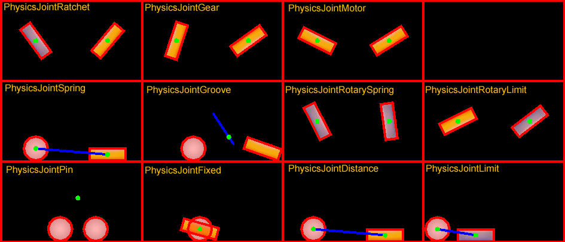

<div class="langs">
  <a href="#" class="btn" onclick="toggleLanguage()">中文</a>
</div>

##Collision
Have you ever been in a car accident? What did you collide with? Just like with
cars, `PhysicBody` objects can come in contact. __Collisions__ are what happens when
`PhysicBody` objects come in contact with each other. When a __collision__ takes
place it can be ignored or it can trigger events to be fired.

###Filtering Collisions
Collision filtering allows you to enable or prevent collisions between shapes.
This __physics engine__ supports collision filtering using __category and group bitmasks__.

There are 32 supported collision categories. For each shape you can specify which
category it belongs to. You can also specify what other categories this shape can
collide with. This is done with masking bits. For example:


auto sprite1 = addSpriteAtPosition(Vec2(s_centre.x - 150,s_centre.y));
sprite1->getPhysicsBody()->setCategoryBitmask(0x02);    // 0010
sprite1->getPhysicsBody()->setCollisionBitmask(0x01);   // 0001

sprite1 = addSpriteAtPosition(Vec2(s_centre.x - 150,s_centre.y + 100));
sprite1->getPhysicsBody()->setCategoryBitmask(0x02);    // 0010
sprite1->getPhysicsBody()->setCollisionBitmask(0x01);   // 0001

auto sprite2 = addSpriteAtPosition(Vec2(s_centre.x + 150,s_centre.y),1);
sprite2->getPhysicsBody()->setCategoryBitmask(0x01);    // 0001
sprite2->getPhysicsBody()->setCollisionBitmask(0x02);   // 0010

auto sprite3 = addSpriteAtPosition(Vec2(s_centre.x + 150,s_centre.y + 100),2);
sprite3->getPhysicsBody()->setCategoryBitmask(0x03);    // 0011
sprite3->getPhysicsBody()->setCollisionBitmask(0x03);   // 0011
```
You can check for collisions by checking and comparing _category_ and _collision_
bitmasks like:
```cpp
if ((shapeA->getCategoryBitmask() & shapeB->getCollisionBitmask()) == 0
   || (shapeB->getCategoryBitmask() & shapeA->getCollisionBitmask()) == 0)
{
   // shapes can't collide
   ret = false;
}



Collision groups let you specify an integral group index. You can have all shapes
with the same group index always collide (positive index) or never collide (negative
index and zero index). Collisions between shapes of different group indices are
filtered according the category and mask bits. In other words, group filtering has
higher precedence than category filtering.

###Contacts/Joints
Recall from the terminology above that __joints__ are how contact points are connected
to each other. Yes, you can think of it just like __joints__ on your own body.
Each joint type has a definition that derives from `PhysicsJoint`. All joints are
connected between two different bodies. One body may be static. You can prevent the
attached bodies from colliding with each other by __joint->setCollisionEnable(false)__.
Many joint definitions require that you provide some geometric data. Often a joint
will be defined by anchor points. The rest of the joint definition data depends
on the joint type.

  >-PhysicsJointFixed: A fixed joint fuses the two bodies together at a reference
 point. Fixed joints are useful for creating complex shapes that can be broken
 apart later.

 >-PhysicsJointLimit: A limit joint imposes a maximum distance between the two
 bodies, as if they were connected by a rope.

 >-PhysicsJointPin: A pin joint allows the two bodies to independently rotate
 around the anchor point as if pinned together.

 >-PhysicsJointDistance: Set the fixed distance with two bodies

 >-PhysicsJointSpring: Connecting two physics bodies together with a spring

 >-PhysicsJointGroove: Attach body a to a line, and attach body b to a dot

 >-PhysicsJointRotarySpring: Likes a spring joint, but works with rotary

 >-PhysicsJointRotaryLimit: Likes a limit joint, but works with rotary

 >-PhysicsJointRatchet: Works like a socket wrench

 >-PhysicsJointGear: Keeps the angular velocity ratio of a pair of bodies constant

 >-PhysicsJointMotor: Keeps the relative angular velocity of a pair of bodies
 constant



###Collision detection
Contacts are objects created by the __physics engine__ to manage the collision
between two shapes. __Contact__ objects are not created by the user, they are
created automatically. There are a few terms associated with contacts.

 >-contact point: A contact point is a point where two shapes touch.

 >-contact normal: A contact normal is a unit vector that points from one shape
 to another.

You can get the `PhysicsShape` from a __contact__. From those you can get the bodies.


bool onContactBegin(PhysicsContact& contact)
{
    auto bodyA = contact.getShapeA()->getBody();
    auto bodyB = contact.getShapeB()->getBody();
    return true;
}


You can get access to __contacts__ by implementing a __contact listener__. The __contact
listener__ supports several events: __begin__, __pre-solve__, __post-solve__ and __separate__.

  >-begin: Two shapes just started touching for the first time this step. Return
true from the callback to process the collision normally or false to cause physics
engine to ignore the collision entirely. If you return false, the _preSolve()_ and
_postSolve()_ callbacks will never be run, but you will still receive a separate
event when the shapes stop overlapping.

 >-pre-solve: Two shapes are touching during this step. Return false from the callback
 to make physics engine ignore the collision this step or true to process it normally.
 Additionally, you may override collision values using _setRestitution()_, _setFriction()_
 or _setSurfaceVelocity()_ to provide custom restitution, friction, or surface velocity
 values.

 >-post-solve: Two shapes are touching and their collision response has been
 processed.

 >-separate: Two shapes have just stopped touching for the first time this step.

You also can use `EventListenerPhysicsContactWithBodies`,
`EventListenerPhysicsContactWithShapes`, `EventListenerPhysicsContactWithGroup`
to listen for the event you're interested with bodies, shapes or groups. Besides this you
also need to set the physics contact related bitmask value, as the contact event
won't be received by default, even if you create the relative __EventListener__.

For example:


bool init()
{
    //create a static PhysicsBody
    auto sprite = addSpriteAtPosition(s_centre,1);
    sprite->setTag(10);
    sprite->getPhysicsBody()->setContactTestBitmask(0xFFFFFFFF);
    sprite->getPhysicsBody()->setDynamic(false);

    //adds contact event listener
    auto contactListener = EventListenerPhysicsContact::create();
    contactListener->onContactBegin = CC_CALLBACK_1(PhysicsDemoCollisionProcessing::onContactBegin, this);
    _eventDispatcher->addEventListenerWithSceneGraphPriority(contactListener, this);

    schedule(CC_SCHEDULE_SELECTOR(PhysicsDemoCollisionProcessing::tick), 0.3f);
    return true;

    return false;
}

void tick(float dt)
{
    auto sprite1 = addSpriteAtPosition(Vec2(s_centre.x + cocos2d::random(-300,300),
      s_centre.y + cocos2d::random(-300,300)));
    auto physicsBody = sprite1->getPhysicsBody();
    physicsBody->setVelocity(Vec2(cocos2d::random(-500,500),cocos2d::random(-500,500)));
    physicsBody->setContactTestBitmask(0xFFFFFFFF);
}

bool onContactBegin(PhysicsContact& contact)
{
    auto nodeA = contact.getShapeA()->getBody()->getNode();
    auto nodeB = contact.getShapeB()->getBody()->getNode();

    if (nodeA && nodeB)
    {
        if (nodeA->getTag() == 10)
        {
            nodeB->removeFromParentAndCleanup(true);
        }
        else if (nodeB->getTag() == 10)
        {
            nodeA->removeFromParentAndCleanup(true);
        }
    }

    //bodies can collide
    return true;
}



