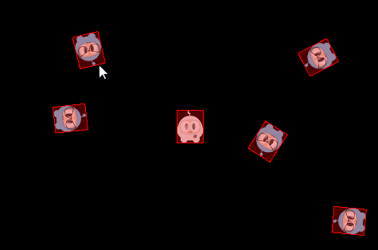

# 术语和概念

为了更好的理解物理引擎，需要先了解下面的一些术语，概念。

## 刚体(Bodies)

__刚体(Bodies)__ 描述了抽象物体的物理属性，包括：质量、位置、旋转角度、速度和阻尼。Cocos2d-x 中用 `PhysicsBody` 对象表示刚体。当刚体和形状关联后，刚体对象才具有几何形状，未关联形状， 刚体只是一个抽象物体的物理属性集。

## 材质(Material)

__材质(Material)__ 描述了抽象物体的材料属性：

>- density：密度，用于计算物体的质量
>- friction：摩擦，用于模拟物体间的接触滑动
>- restitution：恢复系数，模拟物体反弹的一个系数，系数一般设为 0 到 1 之间。0 代表不反弹，1 代表完全反弹。

## 形状(Shape)

__形状(Shape)__ 描述了抽象物体的几何属性，将形状关联到刚体，刚体才具有几何形状。如果需要刚体具有复杂的形状，可以为它关联多个形状，每个形状对象都与一个 `PhysicsMaterial` 相关，并且拥有以下属性：type, area, mass, moment, offset 和 tag。其中有一些你可能还不熟悉，我们来逐一介绍：

>- type：描述了形状的类别，如圆形，矩形，多边形等
>- area：用于计算刚体的质量，密度和面积决定了刚体的质量
>- mass：刚体的质量，影响物体在给定的力下获得的加速度大小，物体在一个引力场中物体受到力的大小
>- moment：刚体获得特定角加速度所需要的扭矩
>- offset：在刚体的当前坐标中，相对于刚体重心的偏移量
>- tag：形状对象的一个标签，你可能还记得，所有的 Node 对象都可以被分配一个 tag，用来进行辨识，实现更容易的访问。形状对象的 tag 作用也一样。

Cocos2d-x 中预定义了这些形状对象：

>- `PhysicsShape`：物理形状的基类
>- `PhysicsShapeCircle`：实心的圆形，无法用它实现一个空心圆
>- `PhysicsShapePolygon`：实心且外凸的多边形
>- `PhysicsShapeBox`：矩形，它是一种特殊的外凸多边形
>- `PhysicsShapeEdgeSegment`：表示一种线段.
>- `PhysicsShapeEdgePolygon`：空心多边形，由多个线段构成的多边形边缘。
>- `PhysicsShapeEdgeBox`：空心矩形，由四个线段组成的矩形边缘
>- `PhysicsShapeEdgeChain`: 链形，它可以有效的把许多边缘连接起来

## 连接/关节

__连接(Contacts)__ 和 __关节(joint)__ 对象描述了刚体相互关联的方式。

## 世界(World)

__世界(World)__ 是现实物理世界的一个游戏模拟，容纳着所有被添加进去的抽象物体。你可以将刚体，形状，约束都添加到物理世界中，然后将整个世界作为一个整体进行更新。物理世界控制着所有元素的相互作用。其中，用物理 API 实现的许多互动都与 _世界(World)_ 有关。

以上有许多需要记住的东西，请对这些都有个大概印象，以便一会用到的时候随时回看。

## PhysicsWorld

__物理世界(PhysicsWorld)__ 是 Cocos2d-x 进行物理模拟的核心对象。物理世界会同时发生很多事情，就像我们生活的世界一样。来想象一个简单的现实场景——厨房，你在思考的时候，就在脑中描绘出了一个厨房的物理世界！厨房世界里拥有一些物体，比如食物，刀具，电器，在这个世界中，这些物体会相互作用。它们会相互接触，并对接触做出反应。比如：用刀子切开食物，并把它放到电器中，做这样一件事。刀子切到食物了吗？可能切到了，也可能还没有，还可能这个刀子根本就不适合做这个。

物理世界(PhysicsWorld)与场景(Scene)进行了深入的整合，只需要调用 `Scene` 对象的 `initWithPhysics()` 方法，就可以创建一个包含物理世界的场景，注意在初始化的时候要进行函数返回值的判断。_`initWithPhysics()` 初始化成功返回 true，失败返回 false_


if( !Scene::initWithPhysics() )
{

}


每一个 _物理世界(PhysicsWorld)_ 都有与之相关的属性：

>- gravity：全局重力，应用于整个物理世界，默认值为 Vec2(0.0f, -98.0f)
>- speed：物理世界的速度，这里的速度指的是这个模拟世界运行的一种比率，默认值是 1.0
>- updateRate：物理世界的刷新率，这里的刷新率指的是 游戏引擎刷新时间与物理世界刷新时间的比值
>- substeps：物理世界中每次刷新的子步数量

刷新物理世界的过程被称为步进，按照默认设置，物理世界会不停地进行自动刷新，这被称为自动步进。每一帧，都会不停地刷新，你可以通过 `setAutoStep(false)` 禁用一个物理世界的自动步进，然后通过 `PhysicsWorld::step(time)` 设定步进时间来手动刷新物理世界。游戏世界是按帧刷新的，物理世界可以通过子步(substeps)的设置，获得更加频繁的刷新，从而进行更精细的步进控制。

__物理刚体(PhysicsBody)__ 对象具有位置和速度，你可以在物理刚体上应用力(forces)，运动(movement)，阻尼(damping)，冲量(impulses)等等。刚体可以是静态的，也可以是动态的，静态的刚体在模拟世界中不会移动，看起来就好像拥有无限大的质量一样，动态的刚体则是一种完全仿真的模拟。刚体可以被玩家手动移动，更常见的是它们受到力的作用而移动。动态刚体可以与所有类型的刚体发生碰撞。Cocos2d-x 提供了 `Node::setPhysicsbody()` 方法实现节点对象和物理刚体对象的关联。

让我们来创建一个静态的物理刚体对象，和五个动态的物理刚体对象，并让五个动态的刚体对象动起来：


auto physicsBody = PhysicsBody::createBox(Size(65.0f, 81.0f),
                        PhysicsMaterial(0.1f, 1.0f, 0.0f));
physicsBody->setDynamic(false);

//create a sprite
auto sprite = Sprite::create("whiteSprite.png");
sprite->setPosition(s_centre);
addChild(sprite);

//apply physicsBody to the sprite
sprite->addComponent(physicsBody);

//add five dynamic bodies
for (int i = 0; i < 5; ++i)
{
    physicsBody = PhysicsBody::createBox(Size(65.0f, 81.0f),
                    PhysicsMaterial(0.1f, 1.0f, 0.0f));

    //set the body isn't affected by the physics world's gravitational force
    physicsBody->setGravityEnable(false);

    //set initial velocity of physicsBody
    physicsBody->setVelocity(Vec2(cocos2d::random(-500,500),
                cocos2d::random(-500,500)));
    physicsBody->setTag(DRAG_BODYS_TAG);

    sprite = Sprite::create("blueSprite.png");
    sprite->setPosition(Vec2(s_centre.x + cocos2d::random(-300,300),
                s_centre.y + cocos2d::random(-300,300)));
    sprite->addComponent(physicsBody);

    addChild(sprite);
}


结果是，五个动态的物理刚体对象和一个静态的物理刚体对象不断的发生碰撞。如图：

