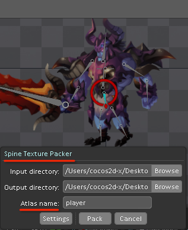

# 骨骼动画详解－Spine

游戏中人物的走动，跑动，攻击等动作是必不可少，实现它们的方法一般采用帧动画或者骨骼动画。

帧动画与骨骼动画的区别在于：帧动画的每一帧都是角色特定姿势的一个快照，动画的流畅性和平滑效果都取决于帧数的多少。而骨骼动画则是把角色的各部分身体部件图片绑定到一根根互相作用连接的“骨头”上，通过控制这些骨骼的位置,旋转方向和放大缩小而生成的动画。

它们需要的图片资源各不相同，如下分别是帧动画和骨骼动画所需的资源图：     
      


骨骼动画比传统的逐帧动画要求更高的处理器性能，但同时它也具有更多的优势，比如：

- 更少的美术资源： 骨骼动画的资源是一块块小的角色部件（比如：头,手,胳膊,腰等等），美术再也不用提供每一帧完整的图片了，这无疑节省了资源大小，能为您节省出更多的人力物力更好的投入到游戏开发中去。
- 更小的体积： 帧动画需要提供每一帧图片。而骨骼动画只需要少量的图片资源，并把骨骼的动画数据保存在一个 json 文件里面（后文会提到），它所占用的空间非常小，并能为你的游戏提供独一无二的动画。
- 更好的流畅性： 骨骼动画使用差值算法计算中间帧，这能让你的动画总是保持流畅的效果。
- 装备附件： 图片绑定在骨骼上来实现动画。如果你需要可以方便的更换角色的装备满足不同的需求。甚至改变角色的样貌来达到动画重用的效果。
- 不同动画可混合使用： 不同的骨骼动画可以被结合到一起。比如一个角色可以转动头部,射击并且同时也在走路。
- 程序动画： 可以通过代码控制骨骼，比如可以实现跟随鼠标的射击，注视敌人，或者上坡时的身体前倾等效果。


## 骨骼动画编辑器——Spine

Spine是一款针对游戏的2D骨骼动画编辑工具,它具有良好的UI设计和完整的功能，是一个比较成熟的骨骼动画编辑器。Spine旨在提供更高效和简洁的工作流程，以创建游戏所需的动画。

使用Spine创建骨骼动画分两大步骤：

1. 在SETUP模式下，组装角色部件，为其绑定骨骼；
2. 在ANIMATE模式下，基于绑定好的骨骼创建动画。

下面简单介绍下具体步骤，更多详细内容请查看官方网站教程：Spine[快速入门教程](http://zh.esotericsoftware.com/spine-quickstart#Character-Images)。

1）在SETUP模式下，选中Images属性，导入所需图片资源所在文件夹，其中路径名和资源名中不能出现中文，否则解析不了；       
2）拖动Images下的图片到场景，对角色进行组装（把各个身体部位拼在一起），可通过Draw Order属性调整图片所在层的顺序；        
3）创建骨骼，并绑定图片到骨骼上，要注意各骨骼的父子关系。        
4）切换到ANIMATE模式，选中要“动”的骨骼，对其进行旋转,移动,缩放等操作，每次改动后要记得打关键帧。        
5）在菜单栏找到Texture Packer项，对角色纹理进行打包，资源文件后缀为atlas（而非Cocos2d-x常用的plist）。打包后将生成两个文件，即：png 和 atlas。    
        
6）导出动画文件Json。   
## Spine动画的使用
Cocos2d-x程序中，使用Spine动画首先需要包含spine的相关头文件。

```
#include <spine/spine-cocos2dx.h>
#include "spine/spine.h"
using namespace spine;
```

其常用方法如下：     
            
创建一个Spine动画对象，将动画文件和资源文件导入。

```
auto skeletonNode = new SkeletonAnimation("enemy.json", "enemy.atlas");
```
骨骼动画往往是不止一个动画的，例如：当人物需要行走时，就设置播放动画为行走；当要发动攻击时，就设置播放动画为攻击。下面方法可以设置当前播放动画，其中参数false表示不循环播放，true表示循环播放。

```
skeletonNode->setAnimation(0, "walk", true);
```
setAnimation方法只能播放一种动画，所以当要连续播放不同的动画时，需要使用addAnimation方法来实现，它可以一条一条的播放不同的动画。

```
skeletonNode->addAnimation(0, "walk", true);
skeletonNode->addAnimation(0, "attack", false);
```
对于一般情况下，动画的切换要求两个动画完全能衔接上，不然会出现跳跃感，这个对于美术来说要求很高，而Spine加了个动画混合的功能来解决这个问题。使得不要求两个动画能完全的衔接上，比如上面的walk和attack动画, 就是衔接不上的，直接按上面的办法播放，会出现跳跃，但是加了混合后，看起来就很自然了。哪怕放慢10倍速度观察，也完美无缺。这个功能在序列帧动画时是无法实现的，也是最体现Spine价值的一个功能。

```
skeletonNode->setMix("walk", "attack", 0.2f);
skeletonNode->setMix("attack", "walk", 0.4f);
```
设置动画的播放快慢可通过设置它的timeScale值来实现。

```
skeletonNode->timeScale = 0.6f;
```
设置是否显示骨骼通过设置debugBones，true表示显示，false表示隐藏。

```
skeletonNode->debugBones = true;
```
例子：创建一个player行走和攻击的动画, 并且循环播放。      

```
auto skeletonNode = new SkeletonAnimation("enemy.json", "enemy.atlas");
skeletonNode->setMix("walk", "attack", 0.2f);
skeletonNode->setMix("attack", "walk", 0.4f);
    
skeletonNode->setAnimation(0, "walk", false);
skeletonNode->setAnimation(0, "attact", false);
skeletonNode->addAnimation(0, "walk", false);
skeletonNode->addAnimation(0, "attact", true);

skeletonNode->debugBones = true;
    
Size windowSize = Director::getInstance()->getWinSize();
skeletonNode->setPosition(Point(windowSize.width / 2, windowSize.height / 2));
addChild(skeletonNode);
```
效果图：      
   