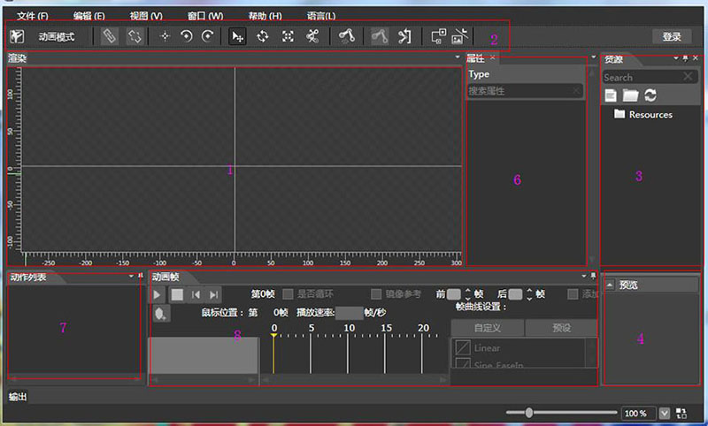
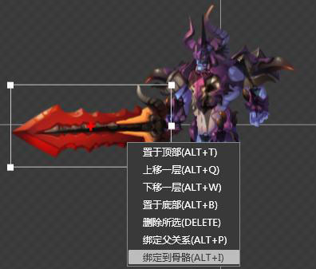
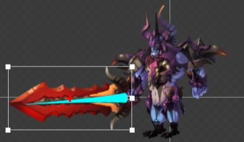
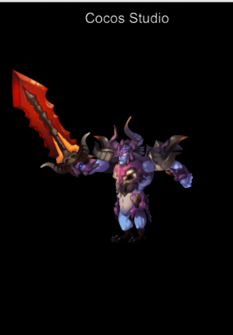
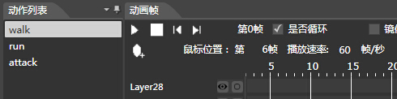

# 骨骼动画详解－Cocos Studio

在之前的[骨骼动画详解－Spine]()一文中，我们已经介绍过什么是骨骼动画，骨骼动画的优缺点，以及骨骼动画编辑器－Spine的使用。接下来本文将结合另一个可编辑骨骼动画的编辑器（Cocos Studio）介绍骨骼动画的使用。

## Cocos Studio介绍

Cocos Studio是一套基于Cocos2d-x的免费游戏开发工具集，它能帮助开发者快速创建游戏资源，将大部分繁琐的游戏开发工作使用编辑器来快速制作，进一步帮助游戏开发者减短开发周期,提高开发效率。

Cocos Studio本身不光只是针对骨骼动画的编辑而设计的，它还提供了UI,场景和数据等信息的编辑工作。就当前的Cocos Studio而言，主要分两种，一种是Win版本的Cocos Studio，另一个则是刚刚发布不久的Mac版 Cocos Studio v1.0 alpha1。前者由UI编辑器,动画编辑器,场景编辑器和数据编辑器四部分组成，分别用于处理游戏中的UI界面,动画资源,游戏场景和游戏数据。而Mac版的Cocos Studio整合了原有的UI和动画编辑器，使小伙伴们的使用更加自由。但由于Mac版的编辑器现在还不稳定，所以本文将介绍Win版本的Cocos Studio。

Win版Cocos Studio的动画编辑器支持关键帧动画，序列帧动画，骨骼动画等多种动画编辑方式。并且它还支持碎图导出，整图导出等多种资源优化方式。同时动画编辑器支持对Flash，PSD，Plist资源的解析。

## 创建骨骼动画

首先，打开Cocos Studio 的 Animation Editor（动画编辑器），新建一个动画工程。         
同Spine一样，Cocos Studio动画编辑器也有两种模式，但这里是形体模式和动画模式。用户需要在形体模式下组装角色部件，并为其绑定骨骼；并在动画模式下调整骨骼相应属性生成骨骼动画。

下面我们先来对编辑器整体做一个认识，见下图。

形体模式下：         
       
动画模式下：         
           

上面两图中，标记为1的部分是渲染区域，也就是我们的画布，它是资源布局的主编辑区，在该区域可以对各对象进行移动，缩放，旋转的操作，所有主要的操作结果都会在这个区域中显示完成。    
  
第2部分是快捷菜单栏，该窗口中有一些常用操作，其中包括模式的切换，创建骨骼，缩放，旋转等等一系列操作。          

第3部分是资源栏，本项目中使用的所有资源都必须导入到该面板才可以使用。            

第4部分是预览区域，当选中资源栏的资源时，会在该区域中显示，达到预览的作用。               

第5部分是对象结构栏，编辑器将根据对象结构栏中对象的顺序依次渲染对象，在最下层的对象将先于渲染，也就是说它可能会被后渲染的对象遮盖。另外，对象的顺序在该栏中是可调的。    
       
第6部分是属性栏，当选中一个对象时，属性窗口会显示出该对象的所有属性。修改任意属性都可以立即改变该节点在渲染区域的状态。

第7部分是动作列表栏，一个动画工程是允许有多个动作的，比如：行走,跳跃,奔跑等等。所以在该栏中用户可以创建多个动作，并在多个动作中切换。

第8部分是动画帧面板，该面板将显示画布中所有对象的序列帧，用户可通过添加帧和改变对象属性创建动画序列帧。

对编辑器有了大致的了解后，现在就可以开始编辑动画了。

1. 在形体模式下，选择 文件->导入资源 或在资源栏中右键选择需要导入的资源文件，也可直接将资源拷入工程的Resources文件夹目录下，然后刷新资源面板。  
2. 将资源拖到渲染区，并摆好位置。
3. 开始创建骨骼：选中快捷菜单栏中创建骨骼的按钮，在角色身体的各部位单击左键并拖动鼠标画出骨骼。
4. 将资源素材与骨骼绑定，右击渲染区的资源素材，选择“绑定到骨骼”，然后选择骨骼（选择的骨骼会高亮显示），就可以实现骨骼的绑定。         
    
5. 当绑定好所有素材和骨骼后，右击骨骼选择“绑定父关系”，再选择该骨骼的父骨骼（选择的骨骼同样会高亮显示），这样依次根据身体部位的“父子”层级关系设定好。
6. 切换到动画模式，选中相应控件，移动鼠标到动画帧一栏的某帧处，然后，改变被选择控件的某个属性，如旋转它，这样就能实现流畅的补间动画。
7. 导出项目为程序可用的资源：导出的资源在工程目录的Export/..文件夹下，一共有三个资源文件，分别是 .ExportJson，.plist 和 .png文件。ExportJson文件中记录了骨骼动画的描述信息，plist文件则是记录碎图整合成大图后图片的位置描述信息，png文件是整合的大图。 

 
## 在 Cocos2d-x 中加载动画资源

前面我们花了很多精力来创建骨骼动画，然而要将它运行在实际的项目中却非常的简单，只需几行代码，当然在这之前我们需要将动画编辑器导出的资源复制到项目Resource目录中去。

同样地，在Cocos2d-x程序中使用Cocos Studio动画首先需要包含相关头文件，如下：

```
#include "cocostudio/CocoStudio.h"
using namespace cocostudio;
```

创建一个骨骼动画对象，需要将动画文件和资源文件载入到程序。这里我们通过ArmatureManager动画数据管理器来加载动画。ArmatureManager本身是一个单例，它管理整个场景中的Armature。而Armature则封装了我们播放动画需要的Animation。由此可见，这是一个三层缔结的层次结构。其中ArmatureManager最大，然后是Armature，最后是Animation。

说完了原理，下面来看看代码。修改init函数, 在return前加入如下代码：  

```
ArmatureDataManager::getInstance()->addArmatureFileInfo("NewAnimation0.png" , "NewAnimation0.plist" , "NewAnimation.ExportJson");
Armature *armature = Armature::create( "NewAnimation");
armature->setPosition(Point(visibleSize.width * 0.5, visibleSize.height * 0.5));
// 播放动画
armature->getAnimation()->play("walk");
this->addChild(armature);
```
效果图：       
      

我们在动画编辑器中编辑的动作就是Animation，一个动画工程中可以编辑多个动作，也就是动作列表中可创建多个动作。如下图所示：        
         
所以播放动画需要根据具体地需要来播放，这样才能知道用户要播放的动画是哪一个。可以像上面代码一样指定动画名来播放动画，也可以通过指定动作编号来播放动画，如下：

```
armature->getAnimation()->playWithIndex(0);
```

播放连续地动画可通过以下函数实现：

```
void playWithNames(const std::vector<std::string>& movementNames, int durationTo = -1, bool loop = true);
void playWithIndexes(const std::vector<int>& movementIndexes, int durationTo = -1, bool loop = true);
```
