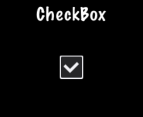

# 复选框(CheckBox)

日常生活中复选框很常见，比如填写问卷时，让我们选一些喜欢的项目，游戏设置中，某一设置是打开还是关闭。只有两种状态的项目经常被设计为复选框。Cocos2d-x 提供 __`Checkbox`__ 对象支持复选框功能。

创建一个复选框：


#include "ui/CocosGUI.h"

auto checkbox = CheckBox::create("check_box_normal.png",
                                 "check_box_normal_press.png",
                                 "check_box_active.png",
                                 "check_box_normal_disable.png",
                                 "check_box_active_disable.png");

checkbox->addTouchEventListener([&](Ref* sender, Widget::TouchEventType type){
        switch (type)
        {
                case ui::Widget::TouchEventType::BEGAN:
                        break;
                case ui::Widget::TouchEventType::ENDED:
                        std::cout << "checkbox 1 clicked" << std::endl;
                        break;
                default:
                        break;
        }
});

this->addChild(checkbox);


在上面的例子中，我们能看到为一个复选框指定了五张图像，因为复选框有五种状态: 未被选中，被点击，未被选中时不可用，被选中，选中时不可用。这样五种状态的图像依次如下：

   
 
 

在屏幕显示的时候，同一个时刻只能看到一个状态，被选中时状态像这样：

