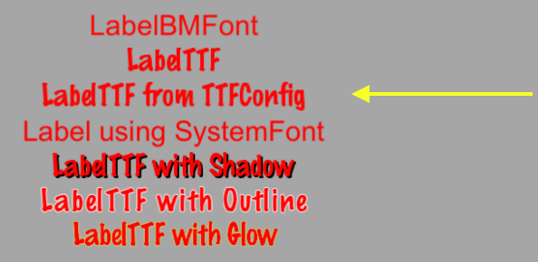

# 标签(Label)

Cocos2d-x 提供 __`Label`__ 对象给用户，可以使用位图字体，TrueType 字体，系统字体创建标签。这个单一的类能处理你所有的标签需求。下面介绍使用各种字体，创建标签的方法。

## BMFont

`BMFont` 是一个使用位图字体创建的标签类型，位图字体中的字符由点阵组成。使用这种字体标签性能非常好，但是不适合缩放。由于点阵的原因，缩放会导致失真。标签中的每一个字符都是一个单独的 `Sprite`，也就是说精灵的属性(旋转，缩放，着色等)控制都适用于这里的每个字符。

创建 `BMFont` 标签需要两个文件：`.fnt` 文件和 `.png` 文件。可以使用像 Glyph Designer 这样的工具来创建位图字体，这些文件将会自动生成。

使用位图字体创建标签：


auto myLabel = Label::createWithBMFont("bitmapRed.fnt", "Your Text");


所有在标签中出现的字符都应该能在提供的 `.fnt` 文件找到，如果找不到，字符就不会被渲染。如果你渲染了一个 `Label`，同时它有丢失字符，记得去查看一下 `.fnt` 文件是否完备。

## TTF

_TrueType 字体_ 和我们上面了解的位图字体不同，使用这种字体很方便，你不需要为每种尺寸和颜色单独使用字体文件。不像 BMFont，如果想不失真的缩放，就要提供多种字体文件。

要创建这种标签，需要指定 `.ttf` 字体文件名，文本字符串和字体大小。

使用 TrueType 字体创建标签：


auto myLabel = Label::createWithTTF("Your Text", "Marker Felt.ttf", 24);


虽然使用 TrueType 字体比使用位图字体更灵活，但是它渲染速度较慢，并且更改标签的属性(字体，大小)是一项非常消耗性能的操作。

如果您需要具有相同属性的多个 Label 对象，那可以创建一个 `TTFConfig` 对象来统一配置，`TTFConfig` 对象允许你设置所有标签的共同属性。

通过以下方式创建一个 `TTFConfig` 对象：


// create a TTFConfig files for labels to share
TTFConfig labelConfig;
labelConfig.fontFilePath = "myFont.ttf";
labelConfig.fontSize = 16;
labelConfig.glyphs = GlyphCollection::DYNAMIC;
labelConfig.outlineSize = 0;
labelConfig.customGlyphs = nullptr;
labelConfig.distanceFieldEnabled = false;

// create a TTF Label from the TTFConfig file.
auto myLabel = Label::createWithTTF(labelConfig, "My Label Text");


`TTFConfig` 也能用于展示中文，日文，韩文的字符。

## SystemFont

`SystemFont` 是一个使用系统默认字体，默认字体大小的标签类型，这样的标签不要改变他的属性，它会使用系统的规则。

使用系统字体创建标签：


auto myLabel = Label::createWithSystemFont("My Label Text", "Arial", 16);


## 标签效果

在屏幕上有标签后，它们可能看起来很普通，这时你希望让他们变漂亮。你不用创建自定义字体! Label 对象就可以对标签应用效果，包括阴影，轮廓，发光。

阴影效果：


auto myLabel = Label::createWithTTF("myFont.ttf", "My Label Text", 16);

// shadow effect is supported by all Label types
myLabel->enableShadow();


轮廓效果:


auto myLabel = Label::createWithTTF("myFont.ttf", "My Label Text", 16);

// outline effect is TTF only, specify the outline color desired
myLabel->enableOutline(Color4B::WHITE, 1));


发光效果:


auto myLabel = Label::createWithTTF("myFont.ttf", "My Label Text", 16);

// glow effect is TTF only, specify the glow color desired.
myLabel->enableGlow(Color4B::YELLOW);


