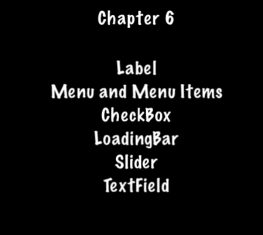

# 菜单(Menu)

菜单是什么，我们肯定都很熟悉了，在每个游戏中都会有菜单。我们使用菜单浏览游戏选项，更改游戏设置。菜单通常包含开始，退出，设置，关于等项，菜单当然也可以包含子菜单。在 Cocos2d-x 提供 __`Menu`__ 对象支持菜单功能，_`Menu` 对象是一种特殊的 `Node` 对象_。

创建一个菜单用于添加菜单项：


auto myMenu = Menu::create();


像我们刚才提到的一个菜单，总会有一些菜单项，比如开始，退出，设置等，没有菜单项的菜单没有存在的意义。Cocos2d-x 提供了一些方法来创建菜单项，比如使用 `Label` 对象，或是使用一张图像。菜单项一般有正常状态和选择状态。菜单项显示时是正常状态，当你点击它时变为选择状态，同时点击菜单还会触发一个回调函数。

使用图像创建菜单：


// creating a menu with a single item

// create a menu item by specifying images
auto closeItem = MenuItemImage::create("CloseNormal.png", "CloseSelected.png",
CC_CALLBACK_1(HelloWorld::menuCloseCallback, this));

auto menu = Menu::create(closeItem, NULL);
this->addChild(menu, 1);


还可以使用 `MenuItem` 的一个 `vector` 创建菜单：


// creating a Menu from a Vector of items
Vector<MenuItem*> MenuItems;

auto closeItem = MenuItemImage::create("CloseNormal.png", "CloseSelected.png",
CC_CALLBACK_1(HelloWorld::menuCloseCallback, this));

MenuItems.pushBack(closeItem);

/* repeat for as many menu items as needed */

auto menu = Menu::createWithArray(MenuItems);
this->addChild(menu, 1);


运行本文档的代码示例，你就能看到在 _Chapter 6_ 有一个 __Label__ 菜单项组成的菜单。

## 使用 Lambda 表达式

我们知道，当您点击菜单项时会触发一个回调函数。C++ 11 支持了 lambda 表达式，lambda 表达式是 [匿名函数](https://en.wikipedia.org/wiki/Anonymous_function#C.2B.2B_.28since_C.2B.2B11.29)，所以你可以在回调方法处，使用 lambda 表达式，这样能让代码看起来更简洁，同时不会有额外的性能开销。

一个简单的 lambda 表达式：


// create a simple Hello World lambda
auto func = [] () { cout << "Hello World"; };

// now call it someplace in code
func();


使用 lambda 表达式作为菜单项的回调函数：


auto closeItem = MenuItemImage::create("CloseNormal.png", "CloseSelected.png",
[&](Ref* sender){
	// your code here
});

